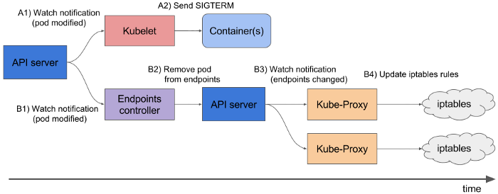
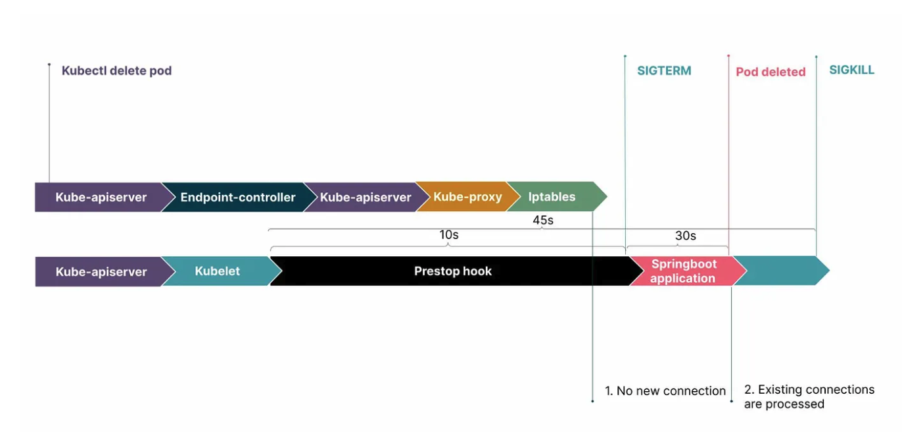

# [Server] Graceful Shutdown
> date - 2020.08.28  
> keyworkd - server, graceful shutdown, spring, kubernetes, nginx  
> Spring Boot 환경에서 graceful shutdown에 대하여 고민하면서 알아본 것들을 정리  
> source code는 [여기](https://github.com/opklnm102/graceful-shutdown-demo)에서 확인할 수 있다

<br>

## Graceful Shutdown이란?
* **grace period(유예 기간)을 두어 정상적인 종료를 위해 기다리고 종료**되는 것으로 처리 중인 task의 유실 가능성을 최소화하기 위해 사용
* grace period는 `timeout`이라고 해석해도 무방할 듯하다
* 보통 하나의 task 처리에 60s가 소요된다면 60s의 유예 기간을 두어 처리가 완료된 후 종료
  * web application이면 새로운 request를 받지 않고, 현재 처리 중이던 request만 처리하고 종료
  * batch application이면 현재 처리 중이던 job을 완료 후 종료
  * message consumer(kafka 등)라면 새로운 message를 consume하지 않고, 현재 처리중인 message만 처리 후 종료
  * TCP sockett이면 abortive close가 아닌 **normal close**
* 보통 application에서 `SIGINT(2)`, `SIGTERM(15)` signal에 대한 처리로 graceful shutdown을 구현

<br>

### Kubernetes의 Pod terminated process
1. Pod의 main process(PID 1)로 `SIGTERM(15)` signal 전송
2. `terminationGracePeriodSeconds`(default. 30s) 동안 기다린다
3. `terminationGracePeriodSeconds` 동안 container가 종료되지 않았다면 `SIGKILL(9)` signal을 전송해 강제 종료시킨다

<br>

> 그러므로 Kubernetes 환경에서는 `SIGTERM(15)` signal 수신시 application이 사용 중이던 resource를 스스로 release하며 shutdown되도록 구현되어야 한다

<br>

## Before Spring Boot 2.3.0
* Spring Boot에서 graceful shutdown에 대한 feature가 없어서 직접 구현하거나 third party library 사용

<br>

### third party library
* [timpeeters/spring-boot-graceful-shutdown - Github](https://github.com/timpeeters/spring-boot-graceful-shutdown)
* [SchweizerischeBundesbahnen/springboot-graceful-shutdown - Github](https://github.com/SchweizerischeBundesbahnen/springboot-graceful-shutdown)
* [gesellix/graceful-shutdown-spring-boot - GitHub](https://github.com/gesellix/graceful-shutdown-spring-boot)
* etc...

<br>

### Flow
1. JVM이 `SIGTERM` signal 수신 후 Spring container shutdown을 시작
2. Spring `EventListener`가 `ContextClosedEvent`를 수신하여 `HealthIndicator`를 통해 ststus를 **out of service**로 변경
3. Load balancer가 `HealthIndicator`의 ststus를 감지하여 traffic 전달을 중지할 수 있도록 sleep을 통해 context shutdown을 지연시켜 Application에서 new request를 전달 받지 않고, 기존의 request 처리 보장
4. sleep 종료가 끝나고, 마지막으로 Spring Context가 close 된다

<br>

### How
* Tomcat을 사용할 경우 아래처럼 직접 구현
```java
/**
 * ContextClosedEvent 수신시 tomcat에서 new request를 수신하지 않도록 한 후 대기
 */
@Slf4j
public class TomcatConnectorGracefulShutdownHandler implements TomcatConnectorCustomizer, ApplicationListener<ContextClosedEvent> {

    private volatile Connector connector;

    private final long timeout;

    public TomcatConnectorGracefulShutdownHandler(long timeout) {
        this.timeout = timeout;
    }

    @Override
    public void customize(Connector connector) {
        this.connector = connector;
    }

    @Override
    public void onApplicationEvent(ContextClosedEvent event) {
        log.info("graceful shutdown...");
        connector.pause();

        Executor executor = connector.getProtocolHandler().getExecutor();
        if (executor instanceof ThreadPoolExecutor) {
            ThreadPoolExecutor threadPoolExecutor = (ThreadPoolExecutor) executor;
            threadPoolExecutor.shutdown();

            try {
                if(!threadPoolExecutor.awaitTermination(timeout, TimeUnit.SECONDS)) {
                    log.warn("Tomcat thread pool did not shutdown gracefully within {} seconds. Proceeding with forceful shutdown", timeout);

                    threadPoolExecutor.shutdownNow();

                    if(!threadPoolExecutor.awaitTermination(timeout, TimeUnit.SECONDS)) {
                        log.error("Tomcat thread pool did not terminate");
                    }
                }
            } catch (InterruptedException e) {
                Thread.currentThread().interrupt();
            }
        }
    }
}
```

* 아래와 같이 shutdown이 진행된다
```java
...
2020-07-01 21:43:02.419  INFO 1 --- [lTaskExecutor-1] m.o.s.PauseController$LongTask           : doing task... count: 0
2020-07-01 21:43:12.557  INFO 1 --- [extShutdownHook] s.TomcatConnectorGracefulShutdownHandler : graceful shutdown...
2020-07-01 21:43:12.811  INFO 1 --- [lTaskExecutor-2] m.o.s.PauseController$LongTask           : doing task... count: 3
2020-07-01 21:43:14.391  INFO 1 --- [lTaskExecutor-1] m.o.s.PauseController$LongTask           : doing task... count: 4
2020-07-01 21:43:15.783  INFO 1 --- [lTaskExecutor-2] m.o.s.PauseController$LongTask           : doing task... count: 4
2020-07-01 21:43:17.392  INFO 1 --- [lTaskExecutor-1] m.o.s.PauseController$LongTask           : doing task... count: 5
2020-07-01 21:43:18.774  INFO 1 --- [extShutdownHook] .o.s.TaskExecutorGracefulShutdownHandler : graceful shutdown...
2020-07-01 21:43:18.784  INFO 1 --- [lTaskExecutor-2] m.o.s.PauseController$LongTask           : doing task... count: 5
...
2020-07-01 21:44:18.707  INFO 1 --- [extShutdownHook] o.s.s.concurrent.ThreadPoolTaskExecutor  : Shutting down ExecutorService 'threadPoolTaskExecutor'
2020-07-01 21:44:18.712  INFO 1 --- [extShutdownHook] o.s.s.concurrent.ThreadPoolTaskExecutor  : Shutting down ExecutorService 'threadPoolTaskExecutor'
2020-07-01 21:44:18.712  INFO 1 --- [extShutdownHook] j.LocalContainerEntityManagerFactoryBean : Closing JPA EntityManagerFactory for persistence unit 'default'
2020-07-01 21:44:18.712  INFO 1 --- [extShutdownHook] .SchemaDropperImpl$DelayedDropActionImpl : HHH000477: Starting delayed evictData of schema as part of SessionFactory shut-down
2020-07-01 21:44:18.716  INFO 1 --- [extShutdownHook] com.zaxxer.hikari.HikariDataSource       : HikariPool-1 - Shutdown initiated...
2020-07-01 21:44:18.725  INFO 1 --- [extShutdownHook] com.zaxxer.hikari.HikariDataSource       : HikariPool-1 - Shutdown completed.
```


<br>

## After Spring Boot 2.3.0
* Jetty, Reactor Netty, Tomcat, Undertow embedded web server와 reactive & servlet-based web application에서 graceful shutdown support
* application context close하는 과정에서 가장 초기에 `SmartLifecycle` Bean을 중지시켜 기존 request는 처리할 수 있지만, 새로운 request는 허용되지 않는 유예 시간을 제공
* 새로운 request가 허용되지 않는 방법은 web server에 따라 다르다
  * Jetty, Reactor Netty, Tomcat - network layer에서 request 수락 중지
  * Undertow - request는 수락하지만 HTTP 503으로 response

<br>

### How
* `server.shutdown` property로 설정
```yaml
server:
  shutdown: graceful  # default. immediate
spring:
  lifecycle:
    timeout-per-shutdown-phase: 60s  # default. 30s
```

* `DefaultLifecycleProcessor`(LifecycleProcessor 구현체)가 `WebServerGracefulShutdownLifecycle`(SmartLifecycle 구현체)를 이용해 WebServer(e.g. Tomcat, Netty...)를 stop 시킨다
```java
class WebServerGracefulShutdownLifecycle implements SmartLifecycle {

	private final WebServerManager serverManager;

	private volatile boolean running;

	WebServerGracefulShutdownLifecycle(WebServerManager serverManager) {
		this.serverManager = serverManager;
	}

	@Override
	public void start() {
		this.running = true;
	}

	@Override
	public void stop() {
		throw new UnsupportedOperationException("Stop must not be invoked directly");
	}

	@Override
	public void stop(Runnable callback) {
		this.running = false;
		this.serverManager.shutDownGracefully(callback);
	}

	@Override
	public boolean isRunning() {
		return this.running;
	}

}
```

* 아래와 같이 shutdown이 진행된다
```java
// Netty
...
2020-09-09 04:44:15.831  INFO 1 --- [           main] m.o.s.SpringWebFluxApplication           : Started SpringWebFluxApplication in 3.176 seconds (JVM running for 3.821)
...
2020-09-09 04:44:33.173  INFO 1 --- [extShutdownHook] o.s.b.w.embedded.netty.GracefulShutdown  : Commencing graceful shutdown. Waiting for active requests to complete
...  // 여기서 부터 new request는 수락하지 않고, 기존 request가 처리될 때 까지 대기
2020-09-09 04:44:33.183  INFO 1 --- [ netty-shutdown] o.s.b.w.embedded.netty.GracefulShutdown  : Graceful shutdown complete
2020-09-09 04:45:33.120  INFO 1 --- [extShutdownHook] o.s.s.concurrent.ThreadPoolTaskExecutor  : Shutting down ExecutorService 'threadPoolTaskExecutor'


// Tomcat
2020-09-09 05:49:13.205  INFO 1 --- [           main] m.o.s.SpringBoot23XApplication           : Started SpringBoot23XApplication in 5.582 seconds (JVM running for 6.284)
...
2020-09-09 06:00:31.190  INFO 1 --- [extShutdownHook] o.s.b.w.e.tomcat.GracefulShutdown        : Commencing graceful shutdown. Waiting for active requests to complete
...
2020-09-09 06:00:37.847  INFO 1 --- [tomcat-shutdown] o.s.b.w.e.tomcat.GracefulShutdown        : Graceful shutdown complete
2020-09-09 06:01:07.858  INFO 1 --- [extShutdownHook] j.LocalContainerEntityManagerFactoryBean : Closing JPA EntityManagerFactory for persistence unit 'default'
2020-09-09 06:01:07.860  INFO 1 --- [extShutdownHook] .SchemaDropperImpl$DelayedDropActionImpl : HHH000477: Starting delayed evictData of schema as part of SessionFactory shut-down
2020-09-09 06:01:07.863  INFO 1 --- [extShutdownHook] o.s.s.concurrent.ThreadPoolTaskExecutor  : Shutting down ExecutorService 'threadPoolTaskExecutor'
2020-09-09 06:01:07.864  INFO 1 --- [extShutdownHook] com.zaxxer.hikari.HikariDataSource       : HikariPool-1 - Shutdown initiated...
2020-09-09 06:01:07.872  INFO 1 --- [extShutdownHook] com.zaxxer.hikari.HikariDataSource       : HikariPool-1 - Shutdown completed.
```
* 위처럼 설정하면 application이 sigterm signal을 수신하면 request 수신을 중단하며 현재 처리 중인 request를 위해 60s 동안 shutdown process가 대기하게 된다
* 위 설정만으로는 `@Async`, `ThreadPoolTaskExecutor`, `ThreadPoolTaskScheduler` 등을 이용한 asynchronous task에 대한 graceful shutdown이 처리되지 않기 때문에 이를 위해 Executor에 setWaitForTasksToCompleteOnShutdown(boolean), setAwaitTerminationSeconds(integer) 설정이 필요하다

<br>

## Asynchronous task
* `TomcatConnectorGracefulShutdownHandler`는 request 처리 보장을 위해 shutdown process를 대기하지만, Asynchronous task의 경우 보장해주지 않는 것을 아래 log를 통해 확인할 수 있다
```java
2020-09-08 05:19:23.014  INFO 1 --- [           main] m.o.s.SpringBoot22XApplication           : Started SpringBoot22XApplication in 5.125 seconds (JVM running for 5.806)
2020-09-08 05:19:27.964  INFO 1 --- [lTaskExecutor-1] m.o.s.PauseController$LongTask           : doing task... count: 0
2020-09-08 05:19:27.965  INFO 1 --- [lTaskExecutor-2] m.o.s.PauseController$LongTask           : doing task... count: 0
2020-09-08 05:19:28.108  INFO 1 --- [lTaskExecutor-3] m.o.s.PauseController$LongTask           : doing task... count: 0
...
2020-09-08 05:19:35.420  INFO 1 --- [extShutdownHook] s.TomcatConnectorGracefulShutdownHandler : graceful shutdown...
...

2020-09-08 05:19:45.936  INFO 1 --- [lTaskExecutor-2] m.o.s.PauseController$LongTask           : doing task... count: 6
2020-09-08 05:19:45.936  INFO 1 --- [lTaskExecutor-1] m.o.s.PauseController$LongTask           : doing task... count: 6
2020-09-08 05:19:46.082  INFO 1 --- [lTaskExecutor-3] m.o.s.PauseController$LongTask           : doing task... count: 6
...
2020-09-08 05:19:47.985  INFO 1 --- [extShutdownHook] o.s.s.concurrent.ThreadPoolTaskExecutor  : Shutting down ExecutorService 'threadPoolTaskExecutor'
2020-09-08 05:19:47.985  INFO 1 --- [extShutdownHook] j.LocalContainerEntityManagerFactoryBean : Closing JPA EntityManagerFactory for persistence unit 'default'
2020-09-08 05:19:47.986  INFO 1 --- [extShutdownHook] .SchemaDropperImpl$DelayedDropActionImpl : HHH000477: Starting delayed evictData of schema as part of SessionFactory shut-down
2020-09-08 05:19:47.990  INFO 1 --- [extShutdownHook] com.zaxxer.hikari.HikariDataSource       : HikariPool-1 - Shutdown initiated...
2020-09-08 05:19:47.999  INFO 1 --- [extShutdownHook] com.zaxxer.hikari.HikariDataSource       : HikariPool-1 - Shutdown completed.
```

<br>

### How
* `Executor` shutdown에도 task 처리 보장을 위한 유예시간 설정
```java
/**
 * ContextClosedEvent 수신시 tomcat에서 new request를 수신하지 않도록 한 후 대기
 */
@Slf4j
public class TaskExecutorGracefulShutdownHandler implements ApplicationListener<ContextClosedEvent> {

    private final List<Executor> executors;

    private final long timeout;

    public TaskExecutorGracefulShutdownHandler(List<Executor> executors, long timeout) {
        this.executors = executors;
        this.timeout = timeout;
    }

    @Override
    public void onApplicationEvent(ContextClosedEvent event) {
        log.info("graceful shutdown...");

        try {
            TimeUnit.SECONDS.sleep(timeout);
        } catch (InterruptedException e) {
            Thread.currentThread().interrupt();
        }

        for (Executor executor : executors) {
            if (executor instanceof ThreadPoolTaskExecutor) {
                ((ThreadPoolTaskExecutor) executor).shutdown();
            }
            if (executor instanceof ThreadPoolExecutor) {
                ThreadPoolExecutor threadPoolExecutor = (ThreadPoolExecutor) executor;
                threadPoolExecutor.shutdown();
            }
        }
    }
}
```

* 아래와 같이 shutdown이 진행된다
```java
2020-09-08 05:13:45.825  INFO 1 --- [lTaskExecutor-1] m.o.s.PauseController$LongTask           : doing task... count: 0
2020-09-08 05:13:45.826  INFO 1 --- [lTaskExecutor-2] m.o.s.PauseController$LongTask           : doing task... count: 0
...
2020-09-08 05:13:56.614  INFO 1 --- [extShutdownHook] s.TomcatConnectorGracefulShutdownHandler : graceful shutdown...
2020-09-08 05:13:56.622  INFO 1 --- [extShutdownHook] .o.s.TaskExecutorGracefulShutdownHandler : graceful shutdown...
...
2020-09-08 05:14:15.808  INFO 1 --- [lTaskExecutor-1] m.o.s.PauseController$LongTask           : done task...  // 1차적으로 처리 중이던 task는 완료
2020-09-08 05:14:15.808  INFO 1 --- [lTaskExecutor-2] m.o.s.PauseController$LongTask           : done task...
2020-09-08 05:14:15.945  INFO 1 --- [lTaskExecutor-3] m.o.s.PauseController$LongTask           : done task...

2020-09-08 05:14:18.809  INFO 1 --- [lTaskExecutor-1] m.o.s.PauseController$LongTask           : doing task... count: 0  // task queue에 있던 것 새로 시작
...
2020-09-08 05:14:56.555  INFO 1 --- [extShutdownHook] o.s.s.concurrent.ThreadPoolTaskExecutor  : Shutting down ExecutorService 'threadPoolTaskExecutor'
2020-09-08 05:14:56.560  INFO 1 --- [extShutdownHook] o.s.s.concurrent.ThreadPoolTaskExecutor  : Shutting down ExecutorService 'threadPoolTaskExecutor'
2020-09-08 05:14:56.561  INFO 1 --- [extShutdownHook] j.LocalContainerEntityManagerFactoryBean : Closing JPA EntityManagerFactory for persistence unit 'default'
2020-09-08 05:14:56.561  INFO 1 --- [extShutdownHook] .SchemaDropperImpl$DelayedDropActionImpl : HHH000477: Starting delayed evictData of schema as part of SessionFactory shut-down
2020-09-08 05:14:56.565  INFO 1 --- [extShutdownHook] com.zaxxer.hikari.HikariDataSource       : HikariPool-1 - Shutdown initiated...
2020-09-08 05:14:56.574  INFO 1 --- [extShutdownHook] com.zaxxer.hikari.HikariDataSource       : HikariPool-1 - Shutdown completed.
```
* Asynchronous task 처리를 위해 대기 시간을 길게 주면 처리를 보장할 수 있다

* 다른 방법으로는 직접 생성하는 ThreadPoolTaskExecutor의 경우는 설정해줄 수 있지만 auto configuration으로 생성되는 bean에는 설정해줄 수 없기 때문에 `BeanPostProcessor`를 이용한다
```java
@ConditionalOnProperty(value = "server.shutdown", havingValue = "graceful")
@Configuration
public class AsyncTaskGracefulShutdownConfiguration {
 
  @Bean
  public BeanPostProcessor taskExecutorGracefulShutdownBeanPostProcessor(LifecycleProperties lifecycleProperties) {
    return new BeanPostProcessor() {
      @Override
      public Object postProcessAfterInitialization(Object bean, String beanName) throws BeansException {
        if (bean instanceof ThreadPoolTaskExecutor) {
          ((ThreadPoolTaskExecutor) bean).setWaitForTasksToCompleteOnShutdown(true);
          ((ThreadPoolTaskExecutor) bean).setAwaitTerminationSeconds(Math.toIntExact(lifecycleProperties.getTimeoutPerShutdownPhase().toSeconds()));
        } else if (bean instanceof ThreadPoolTaskScheduler) {
          ((ThreadPoolTaskScheduler) bean).setWaitForTasksToCompleteOnShutdown(true);
          ((ThreadPoolTaskScheduler) bean).setAwaitTerminationSeconds(Math.toIntExact(lifecycleProperties.getTimeoutPerShutdownPhase().toSeconds()));
        }
        return bean;
      }
    };
  }
}
```

<br>

### Spring WebFlux
* Spring WebFlux도 asynchronous task의 처리는 보장되지 않음을 아래 log를 통해 확인할 수 있다
```java
2020-09-08 06:11:59.313  INFO 1 --- [           main] m.o.s.SpringWebFluxApplication           : Started SpringWebFluxApplication in 2.467 seconds (JVM running for 3.108)
2020-09-08 06:12:04.048  INFO 1 --- [onPool-worker-3] m.o.s.SpringWebFluxApplication           : doing task... count: 0
...
2020-09-08 06:12:11.515  INFO 1 --- [extShutdownHook] o.s.b.w.embedded.netty.GracefulShutdown  : Commencing graceful shutdown. Waiting for active requests to complete
2020-09-08 06:12:13.058  INFO 1 --- [onPool-worker-3] m.o.s.SpringWebFluxApplication           : doing task... count: 3
...
2020-09-08 06:12:20.439  INFO 1 --- [ netty-shutdown] o.s.b.w.embedded.netty.GracefulShutdown  : Graceful shutdown complete
2020-09-08 06:12:22.066  INFO 1 --- [onPool-worker-5] m.o.s.SpringWebFluxApplication           : doing task... count: 6
...
```
* `TaskExecutorGracefulShutdownHandler`와 같은 처리 필요
* Spring Boot 2.3.0부터는 `SmartLifecycle`의 구현체인 `WebServerGracefulShutdownLifecycle` 등을 사용하여 shutdown process를 진행시키므로 `SmartLifecycle`를 이용한다

```java
@Slf4j
public class TaskExecutorGracefulShutdownLifecycle implements SmartLifecycle {

    private final List<Executor> executors;

    private final long timeout;

    private volatile boolean running;

    public TaskExecutorGracefulShutdownLifecycle(List<Executor> executors, long timeout) {
        this.executors = executors;
        this.timeout = timeout;
    }

    @Override
    public void start() {
        this.running = true;
    }

    @Override
    public void stop() {
        this.running = false;
        doStop();
    }

    @Override
    public boolean isRunning() {
        return running;
    }

    @Override
    public int getPhase() {
        return SmartLifecycle.DEFAULT_PHASE - 1;
    }

    private void doStop() {
        log.info("Commencing graceful shutdown. Waiting for active task to complete");

        try {
            TimeUnit.SECONDS.sleep(timeout);
        } catch (InterruptedException e) {
            Thread.currentThread().interrupt();
        }

        for (Executor executor : executors) {
            if (executor instanceof ThreadPoolTaskExecutor) {
                ((ThreadPoolTaskExecutor) executor).shutdown();
            }
            if (executor instanceof ThreadPoolExecutor) {
                ThreadPoolExecutor threadPoolExecutor = (ThreadPoolExecutor) executor;
                threadPoolExecutor.shutdown();
            }
        }

        log.info("Graceful shutdown complete");
    }
}
```


<br>

## Kubernetes Environment
* Kubernetes 환경에서 graceful shutdown 위해 container가 아래의 flow에 맞게 동작해야 한다

<div align="center">
  
</div>

1. Pod는 deploy, scale 등으로 인해 종료시 `SIGTERM` signal 수신
2. Application(Pod)는 GET /health에 HTTP status 500 response하여 readinessProbe failed
3. readinessProbe failed로 traffic이 수신되지 않는다
4. Application start graceful shutdown(e.g. DB Connection close..)
5. Kubernetes는 terminationGracePeriodSeconds(default. 30s) 후 application으로 `SIGKILL` signal로 강제 종료

<div align="center">
  
</div>

* 위의 3번 과정 동안 유입되는 traffic을 방지하기 위해 `preStop hook`을 이용하며 `preStop + timeout-per-shutdown-phase < terminationGracePeriodSeconds`를 지켜야한다
```yaml
apiVersion: apps/v1
kind: Deployment
spec:
...
  template:
    spec:
      terminationGracePeriodSeconds: 75
      containers:
        ...
          lifecycle:
            preStop:
              exec:
                command: ["sh", "-c", "sleep 10"]
          env:
            ...
            - name: SPRING_LIFECYCLE_TIMEOUT-PER-SHUTDOWN-PHASE
              value: "60s"
```
<div align="center">
  
</div>

* 언어나 framework가 지원하지 않거나 application에서 graceful shutdown을 구현할 수 없는 경우 `preStop hook`을 길게주면 효과가 있다

<br>

### Spring Boot actuator + readiness/livenessProbe
* actuator에 health check에 readiness/livenss probe를 위한 check가 추가되었으나 auto configuration으로 설정된 많은 컴포넌트를 확인한다
* `GET /actuator/health/readiness or liveness`로 확인 가능
* 체크하는 항목
  * diskSpace
  * livenessState
  * ping
  * readinessState
  * refreshScope
  * redis
  * db
* MySQL, Redis 등의 dependency가 문제가 있을 때 서비스가 traffic을 받아도 무의미한 경우 dependency의 가용성도 확인 필요
  * dependency의 장애시 application restart는 거의 도움이 되지 않으니 readiness probe만 추가해서 traffic 차단하기만해도 충분하다
* spring boot configuration
```yaml
management:
  endpoint:
    health:
      probes.enabled: true
      show-details: always  # for debugging
      group:
        readiness:  // traffic ready
          include:
          - readinessState
          - db
          - redis
          show-details: always  # for debugging
        liveness:  // alive
          include:
          - livenessState
          show-details: always  # for debugging
```
* kubernetes manifest
```yaml
...
ports:
  - name: app-port
    containerPort: 8080
livenessProbe:
  httpGet:
    path: /actuator/health/liveness
    port: app-port
readinessProbe:
  httpGet:
    path: /actuator/health/readiness
    port: app-port
  timeoutSeconds: 10
startupProbe:
  httpGet:
    path: /actuator/health/liveness
    port: app-port
  initialDelaySeconds: 60
  failureThreshold: 30
lifecycle:
  preStop:
    exec:
      command: ["sh", "-c", "sleep 10"]
```

* test
```sh
$ echo "GET {HOST}/actuator/health/readiness" | vegeta attack -rate=1 -duration=10s | vegeta report
```
* [vegeta](../test/load-testing/vegeta.md)를 참고하여 다양한 시나리오 작성 가능

<br>

### Node.js with express
* Node.js container의 경우를 살펴 본다
* [Sample code](https://github.com/opklnm102/hello-node)를 참고

```js
const state = { isShutdown: false };

app.get('/health', (req, res) => {
  if (state.isShutdown) {
    res.writeHead(500);
    return res.end('not ok');
  }

  res.writeHead(200);
  return res.end('ok');
});

const startGracefulShutdown = () => {
  console.info('Starting shutdown of express...', new Date().toISOString());
  state.isShutdown = true;

  setTimeout(() => {
    server.close()
      .then(() => {
        console.info('shutdown complete');
        process.exit(0);
      })
      .catch((err) => {
        console.error('Error happened during graceful shutdown', err);
        process.exit(1);
      });
  }, TIMEOUT_IN_MS);
};

const signals = ['SIGINT', 'SIGTERM', 'SIGQUIT'];
signals.forEach((signal) => {
  process.on(signal, startGracefulShutdown);
});
```

* Kubernetes의 signal은 PID 1에게 보내기 때문에 container는 `node`로 실행해야 한다
```dockerfile 
...

ENTRYPOINT ["node", "app.js"]
```
* shell form이 아닌 **exec form**을 사용해야 한다

<br>

### Nginx
* Nginx에서 `SIGTERM`은 fast shutdown 되므로 `SIGQUIT`를 사용해야 한다

#### Nginx에서 처리하는 shutdown signal
* master process
| Signal | Description |
|:--|:--|
| TERM, INT | fast shutdown |
| QUIT | graceful shutdown |
| WINCH | graceful shutdown fo worker processes |

* worker process
| Signal | Description |
|:--|:--|
| TERM, INT | fast shutdown |
| QUIT | graceful shutdown |
| WINCH | abnormal termination for debugging(requires debug points to be enabled) |

#### How
* Container Lifecycle Hooks의 preStop에서 `nginx -s quit` 사용
* preStop hook은 Pod가 Terminated 되기 전에 실행된다
```yaml
apiVersion: apps/v1
kind: Deployment
metadata:
  name: nginx
spec:
    spec:
      containers:
      - name: nginx
        image: nginx:1.17.9-alpine
        ports:
        - name: web-port
          containerPort: 80
        readinessProbe:
          httpGet:
            port: web-port
            path: /health
        livenessProbe:
          httpGet:
            port: web-port
            path: /health
        lifecycle:
          preStop:
            exec:
              # SIGTERM triggers a quick exit; gracefully terminate instead
              command: ["nginx", "-s", "quit"]
      terminationGracePeriodSeconds: 60
```

<br>

## Conclusion
* 지금까지 Spring Boot, Node.js, Nginx, Kubernetes에서 Graceful shutdown하는 방법을 정리해보았다
* process, signal, container, framework 등 알아야 하는게 많지만 위의 방법대로 적용해보면 매끄러운 applicaiton을 만들 수 있지 않을까 한다

<br><br>

> #### Reference
> * [Graceful Shutdown Spring Boot Applications](https://blog.marcosbarbero.com/graceful-shutdown-spring-boot-apps)
> * [Graceful Shutdown of a Spring Boot Application](https://www.baeldung.com/spring-boot-graceful-shutdown)
> * [Shutdown a Spring Boot Application](https://www.baeldung.com/spring-boot-shutdown)
> * [Graceful shutdown Spring Boot 2.3.0 Features](https://docs.spring.io/spring-boot/docs/2.3.0.RELEASE/reference/html/spring-boot-features.html#boot-features-graceful-shutdown)
> * [Graceful shutdown with Node.js and Kubernetes](https://blog.risingstack.com/graceful-shutdown-node-js-kubernetes/)
> * [Termination of Pods - Kubernetes Docs](https://kubernetes.io/docs/concepts/workloads/pods/pod/#termination-of-pods)
> * [Graceful shutdown of pods with Kubernetes](https://pracucci.com/graceful-shutdown-of-kubernetes-pods.html)
> * [Controlling nginx - Nginx Docs](http://nginx.org/en/docs/control.html)
> * [Graceful shutdown in Kubernetes is not always trivial](https://medium.com/flant-com/kubernetes-graceful-shutdown-nginx-php-fpm-d5ab266963c2)

<br>

> #### Further reading
> * [Kubernetes best pratices: terminating with grace - Google Cloud Platform](https://cloud.google.com/blog/products/gcp/kubernetes-best-practices-terminating-with-grace)
