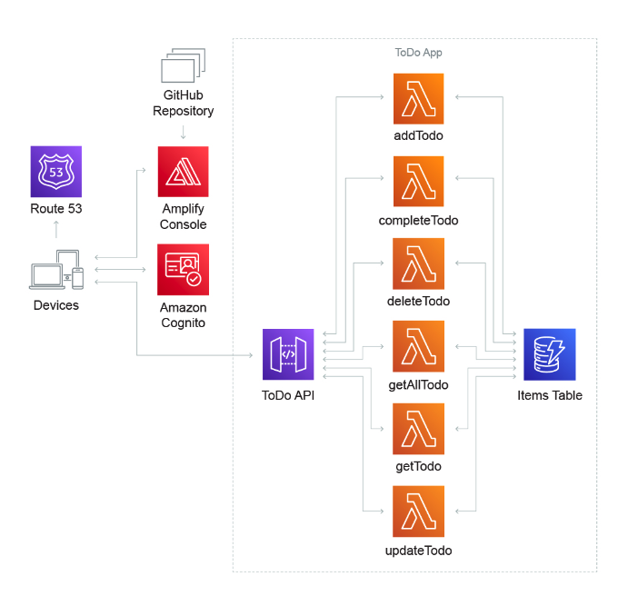
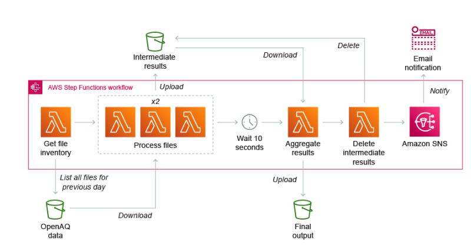

# [Serverless] What is serverless
> date - 2022.10.13  
> keyworkd - serverless  
> serverless에 대해 정리  

 

## serverless란?
* 개발자가 server를 관리할 필요 없이 application을 build & run할 수 있는 cloud native development model
* CSP(Cloud Service Provider, e.g. AWS)가 cloud infrastructure와 application scaling을 모두 관리
* server가 존재하지만 server infrastructure layer를 추상화하여 provisioning, maintaining, scaling 등의 작업을 처리하므로, 개발자는 배포를 위해 code를 packaging만하면 된다
* serverless application은 event-driven execution model로 필요에 따라 auto scaling되므로 사용량이 없으면 비용이 발생하지 않는다
* serverless를 사용하면 OS의 security patch, load balancing, capacity management, scaling, logging, monitoring 등의 작업을 CSP로 이관할 수 있다

 

## serverless computing service는 2가지로 구분된다
* BaaS(Backend-as-a-Service)
* FaaS(Function-as-a-Service)

### BaaS(Backend-as-a-Service)
* 다양한 3rd party service를 API를 통해 사용할 수 있다
* AWS IAM, Amazon S3, AWS KMS 같은 CSP의 인증 서비스, 암호화 서비스, DB 등

 

### FaaS(Function-as-a-Service)
* 개발자가 code를 작성하고, CSP가 제공하는 infrastructure에서 구동된다
* AWS Lambda, Azure Functions 등

 

## Use case

  
  

* asynchronous, stateless 서비스에 이상적이고, 예측할 수 없는 트래픽이 급증하는 서비스에도 좋다
* backend API, serverless web, automation 등에 사용
* 이미지 업로드 같이 드물지만 대량 업로드가 발생할 수 있으므로 대비 필요
* 동영상 업로드시 인코딩, 검증, 태깅이나 이미지 업로드시 썸네일 생성 등 자동화에 사용

 

## Pros & Cons
### Pros
* server provisioning 등 infrastructure 관련 업무의 부담을 줄여 application에 더 많은 시간을 할애할 수 있어 개발 생산성을 높이고 운영 비용을 줄일 수 있다
* 인증, 암호화 등의 3rd party BaaS를 사용해 application 개발을 간소화할 수 있다
* cloud computing 사용 시간만큼 비용을 지불하여 운영 비용이 낮아질 수 있다

 

### Cons
* 자체 server를 사용하지 않는 데에서 오는 단점이 있다
* CSP가 제공하는 방법으로만 3rd party BaaS와 상호작용해야하므로 사용자 시스템의 유연성에 영향을 줄 수 있다
* CSP 벤더 종속성 문제가 발생하여 CSP 변경시 비용이 발생할 수 있다
  * CSP에 따라 제공하는 리소스의 제한이 있다
* cold start 이슈가 있다
  * cold start - 최초 실행시 container가 뜨고 요청을 받을 준비가 되는 시간
  * cold start가 오래 걸리면 서비스에 문제가 발생할 수 있다
* 상태 유지(stateful)를 위해서 external storage(e.g. Amazon S3) 사용 필요

  

> #### Reference
> * [What is serverless?](https://www.redhat.com/en/topics/cloud-native-apps/what-is-serverless)
