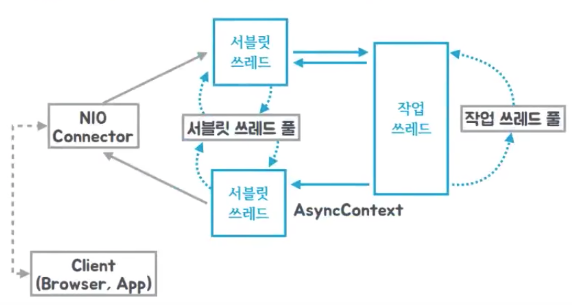
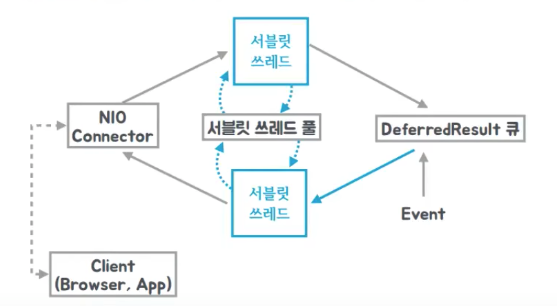

# [Spring] Spring Asynchronous Requests
> date - 2024.04.03  
> keyword - spring, asynchronous, request  
> Spring MVC에서 사용하는 비동기 요청 처리 방법에 대해 정리  

<br>

* servlet API는 filter-servlet chain을 통과하도록 설계되었고, Spring MVC Asynchronous Requests는 filter-servlet chain을 종료하지만 response를 열어두는 메커니즘을 중심으로 구현
  * `ServletRequest.startAsync()`로 asynchronous mode로 전환하여 servlet과 모든 filter가 종료되도 나중에 처리가 완료될 수 있도록 `AsyncContext`를 반환
  * asynchronous task 완료 후 `AsyncContext.dispatch()`로 servlet container thread에 request 처리 재개 요청
  * Spring WebFlux는 asynchronous로 설계되어 모든 단계에서 asynchronous로 동작
* DeferredResult, Callable로 controller method의 **하나의 asynchronous 결과** 값을 처리
* HTTP Streaming - SSE, raw data 등으로 **여러 asynchronous 결과** 값을 stream으로 처리
* reactive client를 사용해 reactive type return


<br>

## Callable
```java
@PostMapping
public Callable<String> processUpload(final MultipartFile file) {
	return () -> "someView";
}
```
* response를 `Callable`로 wrapping하면 WebMvcConfigurer로 설정된 `AsyncTaskExecutor`를 통해 task를 실행하여 결과를 얻을 수 있다
* `Callable`은 `Runnable`처럼 다른 thread에서 실행되도록 설계되었지만 `Runnable`과는 다르게 결과를 반환하고 checked exception을 발생시킬 수 있다

<br>

### Callable processing
1. Controller는 Callable 반환
2. Spring MVC는 `ServletRequest.startAsync()`를 호출하고, 내부의 AsyncTaskExecutor에서 Callable을 처리
3. 그동안 DispatcherServlet과 모든 filter는 servlet container thread를 종료하지만 response는 열린 상태로 유지
4. Callable은 결과를 생성하고 Spring MVC는 request를 Servlet container로 전달(dispatch())
5. DispatcherServlet이 다시 호출되어 Callable의 결과를 response

<div align="center">
  
</div>


<br>

## DeferredResult
```java
@GetMapping("/quotes")
@ResponseBody
public DeferredResult<String> quotes() {
	DeferredResult<String> deferredResult = new DeferredResult<>();
	// Save the deferredResult somewhere..
	return deferredResult;
}

// From some other thread...
deferredResult.setResult(result);
```
* Queue를 이용해 여러 request에 동시 응답
```java
@RestController
public class TestController {
  private final Queue<DeferredResult<String>> results = new ConcurrentLinkedQueue<>();

  @PostMapping("/req")
  public DeferredResult<String> request() {
    var result = new DeferredResult<String>();
    results.add(result);
    return result;
  }

  @PostMapping("/dr/complete")
  public String complete(String message) {
    for (var result : results) {
      result.setResult("Hello " + message);
      results.remove(result);
    }
    return "OK";
  }
}
```
* Spring MVC에서 Asynchronous Requests를 지원하는 class로 Callable 대신 사용
* client request에 대한 처리를 미루고, 나중에 결과를 반환할 수 있다
  * JMS message, scheduled task 등 외부의 event에 의한 결과를 반환시 사용
  * 특정 task/event가 완료된 후 요청을 했던 client에게 응답하는 long polling 방식
* Asynchronous task가 완료되면 결과를 response하여 application은 많은 수의 동시 request를 처리하고 blocking되지 않고도 효율적으로 리소스를 활용할 수 있다
* 별도의 worker thread를 사용하지 않고 application이 선택한 thread에서 결과를 반환할 수 있다
* exception은 다른 controller method와 동일하게 처리(@ExceptionHandler 사용 등)

<br>

### DeferredResult processing
1. Controller는 DeferredResult 반환하고 in-memory queue(or list)에 저장
2. Spring MVC는 `ServletRequest.startAsync()`를 호출
3. 그동안 DispatcherServlet과 모든 filter는 servlet container thread를 종료하지만 response는 열린 상태로 유지
4. application은 다른 thread에서 DeferredResult를 설정(setResult() or setErrorResult())하고 Spring MVC는 request를 Servlet container로 전달(dispatch())
5. DispatcherServlet이 다시 호출되어 DeferredResult의 결과를 response

<div align="center">
  
</div>


<br>

## ResponseBodyEmitter
* object stream을 생성하며 각 object는 HttpMessageConverter로 직렬화(serialzed)되어 response에 쓰여진다
```java
@GetMapping("/events")
// or public ResponseEntity<ResponseBodyEmitter> handle() {
public ResponseBodyEmitter handle() {
  ResponseBodyEmitter emitter = new ResponseBodyEmitter();
  // Save the emitter somewhere..
  return emitter;
}

// In some other thread
emitter.send("Hello once");

// and again later on
emitter.send("Hello again");

// and done at some point
emitter.complete();
```
* ResponseEntity의 body로 `ResponseBodyEmitter`를 사용하여 response status, header 설정 가능

<br>

## SSE(Server-Sent Events)
* `SseEmitter`는 [SSE](https://html.spec.whatwg.org/multipage/server-sent-events.html#server-sent-events) spec을 지원
```java
@GetMapping(path="/events", produces=MediaType.TEXT_EVENT_STREAM_VALUE)
public SseEmitter handle() {
  SseEmitter emitter = new SseEmitter();
  // Save the emitter somewhere..
  return emitter;
}

// In some other thread
emitter.send("Hello once");

// and again later on
emitter.send("Hello again");

// and done at some point
emitter.complete();
```
* SSE는 browser로 streaming하는 main option이지만 internet explorer는 지원하지 않으므로 [Spring WebSocket messaging의 SockJS fallback](https://docs.spring.io/spring-framework/reference/web/websocket/fallback.html) 사용하여 다양한 browser를 지원하는 것을 고려


<br>

## StreamingResponseBody
* 대용량 파일 다운로드, 비동기적으로 대량의 데이터를 전송하는 등의 경우 message converter를 우회하여 OutputStream으로 직접 streaming하기 위해 `StreamingResponseBody` 사용
```java
@GetMapping("/download")
public StreamingResponseBody handle() {
  return outputStream -> {
    // write...
  };
}
```
* ResponseEntity의 body로 `StreamingResponseBody`를 사용하여 response status, header 설정 가능
* application이 servlet container thread를 가디리지 않고 response OutputStream에 직접 write
* async request를 실행하기 위해 Spring MVC에서 사용되는 AsyncTaskExecutor를 명시적으로 설정하는 것을 권장
  * 설정하지 않을 경우 request마다 새로운 thread를 생성하는 `SimpleAsyncTaskExecutor`를 사용하기 때문에 비효율적


<br>

## Reactive Type
* single value에는 DeferredResult를 사용하는 것과 유사한 `Mono` 사용
* streaming media type의 multi-value stream(e.g. application/x-ndjson, text/event-stream)에는 ResponseBodyEmitter, SseEmitter를 사용하는 것과 유사한 Flux(e.g. `Flux<ServerSentEvent>`) 사용
* 다른 media type의 multi-value stream(e.g. application/json)은 DeferredResult<List<?>> 사용하는 것과 유사하게 적용


<br>

## Context Propagation
* 일반적으로 ThreadLocal로 context propagation하지만 multi thread에서 asynchronous 처리할 경우 추가 작업 필요
* Micrometer [Context Propagation](https://github.com/micrometer-metrics/context-propagation#context-propagation-library) library로 쉽게 가능
  * Flux, Mono를 return하는 controller method는 io.micrometer.ThreadLocalAccessor에서 ThreadLocal 값을 reactor context에 기록
  * 외에 경우에는 직접 사용
  ```java
  // Capture ThreadLocal values from the main thread ...
  ContextSnapshot snapshot = ContextSnapshot.captureAll();

  // On a different thread: restore ThreadLocal values
  try (ContextSnapshot.Scope scope = snapshot.setThreadLocals()) {
	// ...
  }
  ```


<br>

## Configuration
* asynchronous request의 timeout을 설저아지 않으면 servlet container에 따라 달라진다
  * DeferredResult, ResponseBodyEmitter, SseEmitter는 timeout 설정이 가능하며, Callable은 WebAsyncTask를 사용해 timeout 설정
* async request를 실행하기 위해 Spring MVC에서 사용되는 AsyncTaskExecutor의 default는 request마다 새로운 thread를 생성하는 `SimpleAsyncTaskExecutor`를 사용하기 때문에 비효율적이므로 ThreadPoolTaskExecutor를 설정하는게 효율적
```java
public interface WebMvcConfigurer {
  ...
  default void configureAsyncSupport(AsyncSupportConfigurer configurer) {
  }
}

@Configuration
public class WebConfiguration implements WebMvcConfigurer {

  @Override
  public void configureAsyncSupport(AsyncSupportConfigurer configurer) {
    var executor = new ThreadPoolTaskExecutor();
    executor.setCorePoolSize(5);  // thread pool의 기본 thread count
    executor.setMaxPoolSize(10);  // queue가 가득차면 증가시킬 thread limit
    executor.setQueueCapacity(25);  // core thread가 모두 사용중일 때 사용할 queue capacity
    executor.setThreadNamePrefix("async-support-");
    executor.initialize();
    configurer.setTaskExecutor(executor);
  }
}
```

### Async 공통 처리 추가
* CallableProcessingInterceptor, DeferredResultProcessingInterceptor 사용
```java
@Configuration
public class WebConfig implements WebMvcConfigurer {

  @Override
  public void configureAsyncSupport(AsyncSupportConfigurer configurer) {
    configurer.registerCallableInterceptors(new CallableProcessingInterceptor() {
    
      @Override
      public <T> Object handleError(NativeWebRequest request, Callable<T> task, Throwable t) throws Exception {
        return CallableProcessingInterceptor.super.handleError(request, task, t);
      }

      @Override
      public <T> Object handleTimeout(NativeWebRequest request, Callable<T> task) throws Exception {
        return CallableProcessingInterceptor.super.handleTimeout(request, task);
      }
    });

    configurer.registerDeferredResultInterceptors(new DeferredResultProcessingInterceptor() {
      @Override
      public <T> boolean handleError(NativeWebRequest request, DeferredResult<T> deferredResult, Throwable t) throws Exception {
        return DeferredResultProcessingInterceptor.super.handleError(request, deferredResult, t);
      }

      @Override
      public <T> boolean handleTimeout(NativeWebRequest request, DeferredResult<T> deferredResult) throws Exception {
        deferredResult.setResult((T) "timeout");;
        return true;
      }
    });
  }
}
```


<br><br>

> #### Reference
> * [Asynchronous Requests](https://docs.spring.io/spring-framework/reference/web/webmvc/mvc-ann-async.html)
