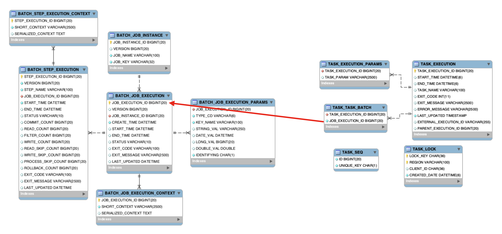

# [Spring Cloud Data Flow] Spring Cloud Dataflow & Spring Cloud Task & Spring Batch metadata
> date - 2023.10.10  
> keyworkd - spring, dataflow, batch, task  
> Spring Cloud Dataflow & Spring Cloud Task & Spring Batch metadata에 대해 정리  

<br>

## Metadata tables
* spring-cloud-dataflow-server는 app_registration, task_definitions에 정보를 저장하고, Task/Scheduler 배포 및 metadata 조회하는 역할
* 각 task/batch가 실행할 때 metadata를 생성하므로 task/batch metadata를 제거해도 SCDF의 동작에는 영향이 없다

| Group | Table | Description |
|:--|:--|:--|
| Spring Cloud Dataflow | app_registration | 등록된 application으로 app, task, source, processor, sink type 사용 |
| Spring Cloud Dataflow | audit_records | audit log |
| Spring Cloud Dataflow | hibernate_sequence | hibernate sequence |
| Spring Cloud Dataflow | stream_definitions | stream 정의 |
| Spring Cloud Dataflow | task_definitions | task 정의 |
| Spring Cloud Dataflow | task_deployment | task deployment history로 task_definitions 참조 |
| Spring Cloud Dataflow | AGGREGATE_JOB_EXECUTION | BATCH_JOB_EXECUTION + BOOT3_BATCH_JOB_EXECUTION aggregated view |
| Spring Cloud Dataflow | AGGREGATE_JOB_INSTANCE | BATCH_JOB_INSTANCE + BOOT3_BATCH_JOB_INSTANCE aggregated view |
| Spring Cloud Dataflow | AGGREGATE_STEP_EXECUTION | BATCH_STEP_EXECUTION + BOOT3_BATCH_STEP_EXECUTION aggregated view |
| Spring Cloud Dataflow | AGGREGATE_TASK_BATCH | TASK_TASK_BATCH + BOOT3_TASK_TASK_BATCH aggregated view |
| Spring Cloud Dataflow | AGGREGATE_TASK_EXECUTION | TASK_EXECUTION + BOOT3_TASK_EXECUTION aggregated view |
| Spring Cloud Dataflow | AGGREGATE_TASK_EXECUTION_PARAMS | TASK_EXECUTION_PARAMS + BOOT3_TASK_EXECUTION_PARAMS aggregated view |
| Spring Boot 2 | BATCH_JOB_EXECUTION | Spring Batch metadata |
| Spring Boot 2 | BATCH_JOB_EXECUTION_CONTEXT | Spring Batch metadata |
| Spring Boot 2 | BATCH_JOB_EXECUTION_PARAMS | Spring Batch metadata |
| Spring Boot 2 | BATCH_JOB_EXECUTION_SEQ | Spring Batch metadata |
| Spring Boot 2 | BATCH_JOB_INSTANCE | Spring Batch metadata |
| Spring Boot 2 | BATCH_JOB_SEQ | Spring Batch metadata |
| Spring Boot 2 | BATCH_STEP_EXECUTION | Spring Batch metadata |
| Spring Boot 2 | BATCH_STEP_EXECUTION_CONTEXT | Spring Batch metadata |
| Spring Boot 2 | BATCH_STEP_EXECUTION_SEQ | Spring Batch metadata |
| Spring Boot 2 | TASK_EXECUTION | Spring Cloud Task metadata |
| Spring Boot 2 | TASK_EXECUTION_PARAMS | Spring Cloud Task metadata |
| Spring Boot 2 | TASK_TASK_BATCH | Spring Cloud Task metadata |
| Spring Boot 2 | TASK_LOCK | Spring Cloud Task metadata |
| Spring Boot 2 | TASK_SEQ | Spring Cloud Task metadata |
| Spring Boot 2 | TASK_EXECUTION_METADATA | Spring Cloud Task metadata |
| Spring Boot 2 | TASK_EXECUTION_METADATA_SEQ | Spring Cloud Task metadata |
| Spring Boot 3 | BOOT3_BATCH_JOB_EXECUTION | Spring Batch metadata |
| Spring Boot 3 | BOOT3_BATCH_JOB_EXECUTION_CONTEXT | Spring Batch metadata |
| Spring Boot 3 | BOOT3_BATCH_JOB_EXECUTION_PARAMS | Spring Batch metadata |
| Spring Boot 3 | BOOT3_BATCH_JOB_EXECUTION_SEQ | Spring Batch metadata |
| Spring Boot 3 | BOOT3_BATCH_JOB_INSTANCE | Spring Batch metadata |
| Spring Boot 3 | BOOT3_BATCH_JOB_SEQ | Spring Batch metadata |
| Spring Boot 3 | BOOT3_BATCH_STEP_EXECUTION | Spring Batch metadata |
| Spring Boot 3 | BOOT3_BATCH_STEP_EXECUTION_CONTEXT | Spring Batch metadata |
| Spring Boot 3 | BOOT3_BATCH_STEP_EXECUTION_SEQ | Spring Batch metadata
| Spring Boot 3 | BOOT3_TASK_EXECUTION | Spring Cloud Task metadata |
| Spring Boot 3 | BOOT3_TASK_EXECUTION_METADATA | Spring Cloud Task metadata |
| Spring Boot 3 | BOOT3_TASK_EXECUTION_METADATA_SEQ | Spring Cloud Task metadata |
| Spring Boot 3 | BOOT3_TASK_EXECUTION_PARAMS | Spring Cloud Task metadata |
| Spring Boot 3 | BOOT3_TASK_LOCK | Spring Cloud Task metadata |
| Spring Boot 3 | BOOT3_TASK_SEQ | Spring Cloud Task metadata |
| Spring Boot 3 | BOOT3_TASK_TASK_BATCH | Spring Cloud Task metadata |

<br>

<div align="center">
  
</div>

### [Spring Batch metadata schema](https://docs.spring.io/spring-batch/docs/current/reference/html/schema-appendix.html#metaDataSchema)
* BATCH_JOB_EXECUTION
* BATCH_JOB_EXECUTION_CONTEXT
* BATCH_JOB_EXECUTION_PARAMS
* BATCH_JOB_INSTANCE
* BATCH_STEP_EXECUTION
* BATCH_STEP_EXECUTION_CONTEXT

<br>

### [Spring Cloud Task metadata schema](https://docs.spring.io/spring-cloud-task/docs/current/reference/html/#appendix-task-repository-schema)
* TASK_EXECUTION
* TASK_EXECUTION_PARAMS
* TASK_LOCK
* TASK_SEQ
* TASK_TASK_BATCH


<br>

## batch, task metadata 조회
* batch table 조회
```sql
SELECT *
FROM BATCH_JOB_EXECUTION
JOIN BATCH_JOB_EXECUTION_CONTEXT
  ON BATCH_JOB_EXECUTION.JOB_EXECUTION_ID = BATCH_JOB_EXECUTION_CONTEXT.JOB_EXECUTION_ID
JOIN BATCH_JOB_EXECUTION_PARAMS
  ON BATCH_JOB_EXECUTION.JOB_EXECUTION_ID = BATCH_JOB_EXECUTION_PARAMS.JOB_EXECUTION_ID
WHERE BATCH_JOB_EXECUTION.JOB_EXECUTION_ID = <job execution id>;
```

* task table 조회
```sql
SELECT *
FROM TASK_EXECUTION
JOIN TASK_EXECUTION_PARAMS
  ON TASK_EXECUTION_PARAMS.TASK_EXECUTION_ID = TASK_EXECUTION.TASK_EXECUTION_ID
JOIN TASK_EXECUTION_METADATA
  ON TASK_EXECUTION_METADATA.task_execution_id = TASK_EXECUTION.TASK_EXECUTION_ID
JOIN TASK_TASK_BATCH
  ON TASK_TASK_BATCH.TASK_EXECUTION_ID = TASK_EXECUTION.TASK_EXECUTION_ID
WHERE TASK_EXECUTION.TASK_EXECUTION_ID = <task execution id>
```

* task, batch table 조회
```sql
SELECT *
FROM TASK_EXECUTION
JOIN TASK_EXECUTION_PARAMS
  ON TASK_EXECUTION_PARAMS.TASK_EXECUTION_ID = TASK_EXECUTION.TASK_EXECUTION_ID
JOIN TASK_EXECUTION_METADATA
  ON TASK_EXECUTION_METADATA.task_execution_id = TASK_EXECUTION.TASK_EXECUTION_ID
JOIN TASK_TASK_BATCH
  ON TASK_TASK_BATCH.TASK_EXECUTION_ID = TASK_EXECUTION.TASK_EXECUTION_ID
JOIN BATCH_JOB_EXECUTION
  ON BATCH_JOB_EXECUTION.JOB_EXECUTION_ID = TASK_TASK_BATCH.JOB_EXECUTION_ID
JOIN BATCH_JOB_EXECUTION_CONTEXT
  ON BATCH_JOB_EXECUTION.JOB_EXECUTION_ID = BATCH_JOB_EXECUTION_CONTEXT.JOB_EXECUTION_ID
JOIN BATCH_JOB_EXECUTION_PARAMS
  ON BATCH_JOB_EXECUTION.JOB_EXECUTION_ID = BATCH_JOB_EXECUTION_PARAMS.JOB_EXECUTION_ID
WHERE TASK_EXECUTION.TASK_EXECUTION_ID = <task execution id>
```


<br>

## batch, task metadata 제거
* 관리되고 있지 않은 metadata로 인해 spring-cloud-dataflow-server에서 metadata 조회시 `java.net.SocketTimeoutException: Read timed out`이 발생할 수 있으므로 주기적으로 정리 필요
* 아래의 절차를 자동화하는 것을 추천

### 1. CronJob 일시 정지
```sh
#!/usr/bin/env bash
 
for namespace in $(kubectl get ns -o=jsonpath='{.items[*].metadata.name}'); do
  for cronjob in $(kubectl get cronjob -n "${namespace}" -o name); do
    kubectl patch -n "${namespace}" -p '{"spec":{"suspend":false}}' "${cronjob}"
  done
done
```

<br>

### 2. 제거 전 row count 확인
```sql
SELECT count(*) FROM <table>;
```

<br>

### 3. 제거
* 특정 날짜 이전 데이터만 정리하거나 truncate 사용

#### truncate
* FK가 걸려 있어서 TRUNCATE가 불가능하므로 FK check disable 후 진행
```sql
SET FOREIGN_KEY_CHECKS = 0;
 
TRUNCATE TABLE batch.BATCH_JOB_EXECUTION_CONTEXT;
TRUNCATE TABLE batch.BATCH_JOB_EXECUTION;
TRUNCATE TABLE batch.BATCH_JOB_EXECUTION_PARAMS;
TRUNCATE TABLE batch.BATCH_JOB_INSTANCE;
TRUNCATE TABLE batch.BATCH_STEP_EXECUTION_CONTEXT;
TRUNCATE TABLE batch.BATCH_STEP_EXECUTION;
 
TRUNCATE TABLE batch.TASK_EXECUTION;
TRUNCATE TABLE batch.TASK_LOCK;
TRUNCATE TABLE batch.TASK_SEQ;
TRUNCATE TABLE batch.TASK_TASK_BATCH;
TRUNCATE TABLE batch.TASK_EXECUTION_PARAMS;
 
SET FOREIGN_KEY_CHECKS = 1;
```

#### 특정 날짜 이전 데이터 제거
* SCDF tools의 Clean up all task/job executions 기능을 사용하거나 JOB_EXECUTION_ID table에는 날짜 column에 index가 없어서 PK 기반으로 확인하여 원하는 날짜의 PK를 확인하여 SQL을 만들어 줘야한다
```sql
# task execution id 조회
SELECT *
FROM TASK_EXECUTION
ORDER BY TASK_EXECUTION_ID DESC;
 
# 위에서 구한 TASK_EXECUTION_ID 기반으로 하나씩 제거해야할 수도 있다
DELETE FROM TASK_EXECUTION WHERE TASK_EXECUTION_ID < <task execution id>;
DELETE FROM TASK_EXECUTION_PARAMS WHERE TASK_EXECUTION_ID < <task execution id>;
...
```

<br>

### 4. 제거 후 row count 확인
```sql
SELECT count(*) FROM <table>;
```

<br>

### 5. CronJob 일시 정지 해제
```sh
#!/usr/bin/env bash
 
for namespace in $(kubectl get ns -o=jsonpath='{.items[*].metadata.name}'); do
  for cronjob in $(kubectl get cronjob -n "${namespace}" -o name); do
    kubectl patch -n "${namespace}" -p '{"spec":{"suspend":true}}' "${cronjob}"
  done
done
```


<br><br>

> #### Reference
> * [Spring Cloud Data Flow Reference Guide](https://docs.spring.io/spring-cloud-dataflow/docs/current/reference/htmlsingle/)
> * [Spring Cloud Task Reference Guide](https://docs.spring.io/spring-cloud-task/docs/current/reference/html)
> * [Meta-Data Schema - Spring Batch Reference Documentation](https://docs.spring.io/spring-batch/docs/current/reference/html/schema-appendix.html#metaDataSchema)
