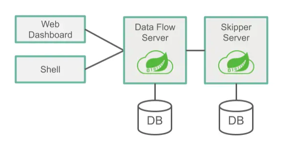
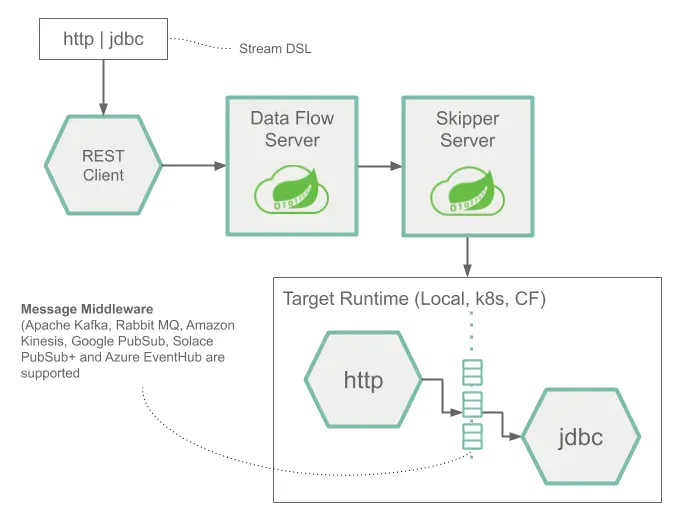
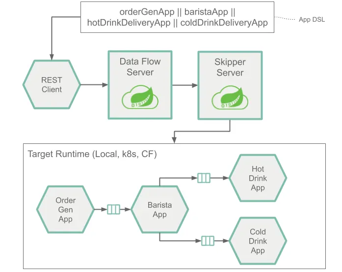
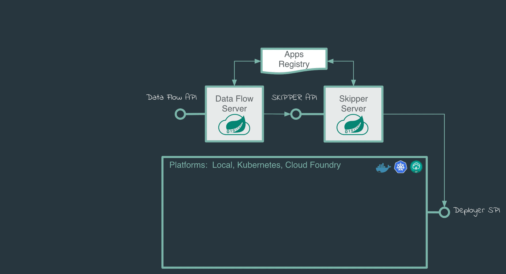
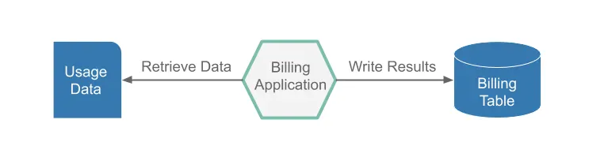
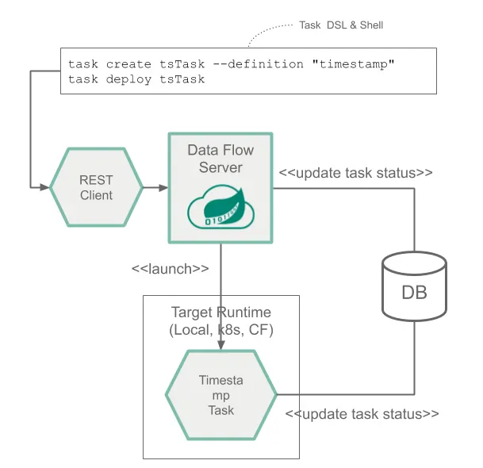
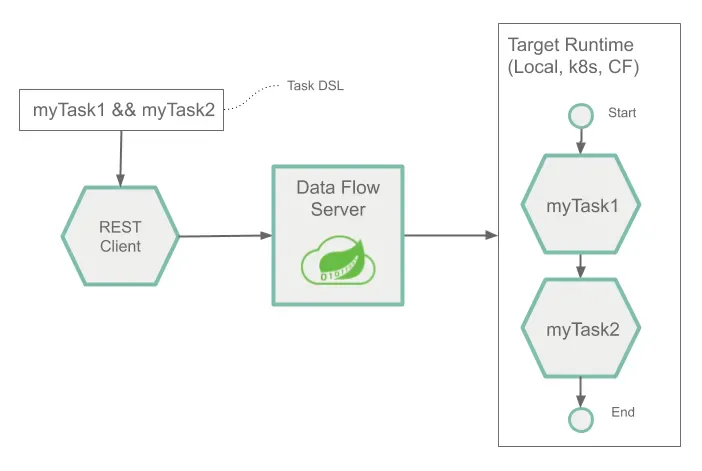
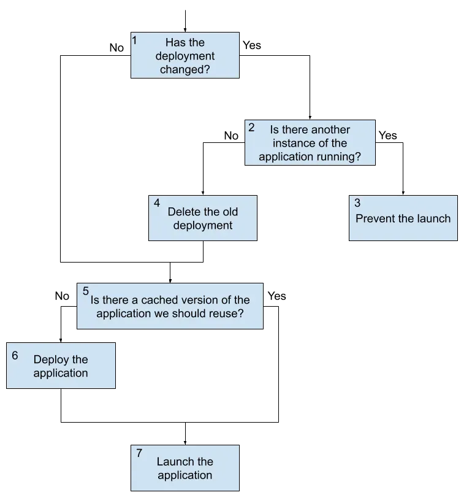
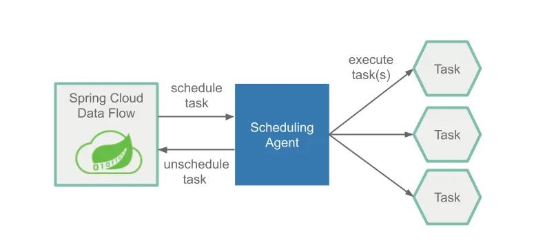
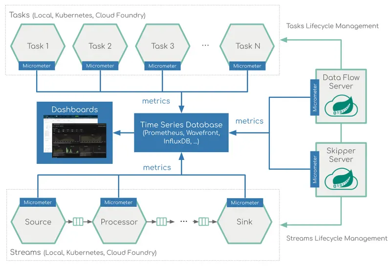

# [Spring Cloud Data Flow] What is Spring Cloud Data Flow
> date - 2023.01.22  
> keyworkd - spring, cloud, dataflow  
> Spring Cloud Dataflow를 Kubernetes에 배포했을 경우에 대해 정리  

<br>

## Spring Cloud Data Flow란?
* Cloud Foundry, Kubernetes를 위한 Microservice 기반 streaming & batch data processing
* pre-built stream, task/batch [starter app](https://docs.spring.io/spring-cloud-dataflow/docs/current/reference/htmlsingle/#_available_applications)이나 [custom](https://docs.spring.io/spring-cloud-dataflow/docs/current/reference/htmlsingle/#custom-applications) app 사용 가능
* [Spring Cloud Stream](https://spring.io/projects/spring-cloud-stream), [Spring Cloud Task](https://spring.io/projects/spring-cloud-task)로 만든 [Spring Boot](https://spring.io/projects/spring-boot/) application으로 복잡한 topology의 streaming, batch data pipeline을 구성
  * Spring Cloud Stream - shared messaging system과 연결된 event-driven microservice를 구현하기 위한 framework로 persistent pub/sub semantics, consumer groups, stateful partitions 등의 best pratices 제공
  * Spring Cloud Task - Spring Boot application에 `@EnableTask`만 추가하면 Spring Cloud 기반의 short lived microservice를 구현
* Web UI, REST API 등 다양한 interface 제공
  * spring batch와 spring cloud task의 meta table에 실행 결과 저장하고 Web UI에서 조회
* [Spring Cloud Deployer](https://github.com/spring-cloud/spring-cloud-deployer/)를 사용해 data pipeline을 Cloud Foundry, Kubernetes 등에 배포

<br>

### Spring Cloud Data Flow vs Airflow
| | Spring Cloud Data Flow | Airflow |
|:--|:--|:--|
| Stream | O | X |
| Batch | O | O |
| 언어 | Java | Python |


<br>

## Architecture
<div align="left">
  
</div>

<br>

### Data Flow server
* Web Dashboard, RESTful API 지원
* DSL 기반으로 stream, batch job 정의
* batch job 배포는 deployment properties 기반으로 Kubernetes Pod 생성
* scheduler 배포는 Kubernetes CronJob 생성
* stream 배포는 `Skipper`에 위임

<br>

### Skipper server
* [Spring Cloud Skipper](https://spring.io/projects/spring-cloud-skipper)로 stream lifecycle management
  * stream 배포
  * blue/green update로 stream upgrade, roll back 


<br>

## Application Type
* maven repository 등의 저장소에 저장된 `uber-jar`, container registry의 `container image`를 사용

<br>

### long-lived application
* single/multi input/output message-driven application
  * application간의 통신을 위해 Message Broker(RabbitMQ, Kafka) 사용
* `Spring Cloud Stream` application
  * Stream Processing에 적합
  * Real-time credit card fraud detection or predictive analytics
  * Near-real-time business data processing for actionable analytics
* binding interface인 `Source`, `Sink`, `Processor`로 input, output을 정의하여 message exchange pattern 사용
  * Source - message producer
  * Sink - message consumer
  * Processor - message 변환 등의 message를 처리

<br>

<div align="center">
  
  
</div>

```sh
## register source http
dataflow:> app register --name http --type source --uri docker://springcloudstream/http-source-kafka:3.2.0

## register sink log
dataflow:> app register --name log --type sink --uri docker://springcloudstream/log-sink-kafka:3.2.0

## create stream http -> log
dataflow:> stream create --name http-stream --definition "http | log"
```
> * [springcloudstream/http-source-kafka](https://hub.docker.com/r/springcloudstream/http-source-kafka)
> * [springcloudstream/log-sink-kafka](https://hub.docker.com/r/springcloudstream/log-sink-kafka)

<br>

#### Continuous Delivery
streaming data pipeline에서 downtime 방지를 위해 변경된 application만 roll out
<div align="left">
  
</div>

<br>

* Upgrade
```sh
dataflow:> stream update --name [stream name] --properties [properties]

## example
### register new app
dataflow:> app register --name log --type sink --uri docker://springcloudstream/log-sink-kafka:3.2.1

### update stream 
dataflow:> stream update --name http-ingest --properties "version.log=2.1.0.RELEASE"
```
* Rollback
```sh
dataflow:> stream rollback [stream name] --releaseVersion [version]

## example
dataflow:> stream rollback http-ingest --releaseVersion 1
```

<br>

### short-lived application
<div align="left">
  
</div>

* `Spring Cloud Task`, `Spring Batch` application
* Batch Processing(상호 작용, 중단 없이 유한한 data 처리), 1회성 job에 적합
  * 4시간 소요 작업 중간에 중단시 중단된 위치부터 다시 시작할 수 있는 기능을 `Spring Batch`에서 제공
* job 실행시 Pod 생성 -> job 종료시 Pod 종료
* single, composed job으로 구성할 수 있다

<br>

#### Single Task
<div align="left">
  
</div>

```sh
dataflow:> app register --name timestamp --type task --uri docker://springcloudtask/timestamp-task:2.0.2

dataflow:> task create timestamp-task --definition "timestamp"
```
> * [springcloudtask/timestamp-task](https://hub.docker.com/r/springcloudtask/timestamp-task)

<br>

#### Composed Tasks
<div align="left">
  
</div>

```sh
dataflow:> task create simple-composed-task --definition "task1 && task2"
```

<br>

#### Continuous Delivery
<div align="left">
  
</div>

* task definition 생성 후 launch
```sh
dataflow:> app register --name timestamp --type task --uri docker://springcloudtask/timestamp-task:2.0.1

dataflow:> task create timestamp-task --definition "timestamp"

dataflow:> task launch timestamp-task --properties "app.timestamp.format=YYYY"
```

* new version deploy
```sh
## new version task definition 생성
dataflow:> app register --name timestamp --type task --uri docker://springcloudtask/timestamp-task:2.0.2

## default version으로 설정
dataflow:> app default --id task:timestamp --version 2.0.2

## launch
dataflow:> task launch timestamp-task
```


<br>

## Batch Job Scheduling
<div align="left">
  
</div>

* [Batch Job Scheduling](https://dataflow.spring.io/docs/feature-guides/batch/scheduling) 참고
* Cloud Foundry, Kubernetes의 schedule 기능을 활용해 batch job scheduling
  * Kubernetes - `CronJob` 생성


<br>

## Tools
다양한 interface의 tool 제공

* Dashboard
  * Web UI로 아래의 기능 제공
  * Apps - application을 등록, 등록된 application 조회 제공
  * Runtime - 실행 중인 application list 제공
  * Streams - stream definition list, design, create, deploy, destroy
  * Tasks - task definition list, create, launch, schedule, destroy
  * Jobs - Spring Batch job history, restart job
  * Audit Records - audit events 조회
* Shell
  * Data Flow CLI
* RESTful API
* Java Client


<br>

## Example - Stream backup pipeline 
* 매일 전날 data backup pipeline을 starter app 1 + custom app 5 조합으로 Source, Processor, Sink 구성

<br>

### Source
#### time-source
```sh
time-source --cron='0 0 4 * * *'
```
* pipeline을 특정 일시에 시작하는 custom source
* 특정 시간에 현재 날짜를 `yyyyMMdd` format으로 전달하여 pipeline을 해당 일시에 실행

<br>

### Processor
#### window-list-processor
```sh
window-list-processor --query="SELECT MIN(id) AS minId, MAX(id) AS maxId FROM transaction WHERE tx_dt='${yesterday}'"
                      --window-size=1000
```
* 전체 data를 window로 분리하는 custom processor
* large data를 primary key같은 특정 기준을 사용해 여러 구간(window)로 나누어 처리하여 부하 감소 및 window 단위로 병렬 처리 가능하도록 구성
* `--window-size` - window 1개에 있는 data 수

#### splitter
```sh
splitter --expression=#jsonPath(payload, '$.windowList')
```
* list를 분할하여 분할하여 각 원소를 다음 pipeline으로 1:1로 전달하여 병렬 처리가 가능하게하는 starter processor
* 다음 application을 scale-out할 시 Load Balancer 역할
* expression - 분산 시킬 리스트

#### jdbc-list-processor
```sh
jdbc-list-processor --query="SELECT id, user_id,... FROM xx WHERE id >= ${min} AND id <= ${max};"
```
* primary key 구간 사이의 data를 JDBC로 조회하는 custom processor
* SQL에 `${yesterday}`, `${today}`같은 keyword를 사용해 날짜기반으로 사용할 수 있다
```sql
SELECT *
FROM transaction
WHERE dt BETWEEN '${yesterday}' AND '${today}';
```

#### field-add-processor
```
field-add-processor --value=${today} --key='backup_dt'
```
* data에 field를 추가하는 custom processor
  * key - field
  * value - field에 추가될 값

<br>

### Sink
#### jdbc-list-sink
```
jdbc-list-sink --table=xxx
               --columns=id,user_id
               --chunk-size=1000
```
* ResultSet을 받아 JDBC로 저장하는 custom sink
  * table, columns - 저장할 table, columns 지정
  * chunk-size - bulk insert unit


<br>

## Monitoring
<div align="left">
  
</div>

stream & task pipeline을 metrics으로 monitoring
* [Wavefront](https://docs.wavefront.com/wavefront_introduction.html)
* [Prometheus](https://prometheus.io/)
  * [Prometheus RSocket Proxy](https://github.com/micrometer-metrics/prometheus-rsocket-proxy)로 long-lived(streams) & short-lived(tasks) application support
* [InfluxDB](https://www.influxdata.com/)

<br><br>

> #### Reference
> * [Spring Cloud Data Flow](https://dataflow.spring.io/)
> * [Spring Cloud Data Flow Reference Guide](https://docs.spring.io/spring-cloud-dataflow/docs/current/reference/htmlsingle/#custom-applications)
