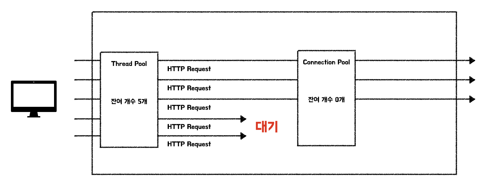

# [Spring Data Jpa] Tuning DB connection pool
> date - 2023.07.31  
> keyworkd - jpa, connection  
> connection pool의 connection이 부족한 이슈를 해결하는 과정을 정리  

<br>

## TL;DR
* 제어할 수 없는 영역인 외부 서비스가 transaction에 포함되면 응답이 올 떄까지 transaction이 대기하고, connection 보유 시간이 길어진다
* connection pool에 connection을 반납하지 않으면 connection pool에서 connection 획득시 bottleneck이 발생할 수 있다
* 그러므로 transaction의 범위를 최소화하여 비효율을 개선할 수 있다


<br>

## Issue
* 지속적으로 `Connection is not available, request timed out after 10000ms.` 발생
* DB connection pool 부족 문제로 traffic에 부하가 발생하면 througput이 감소


<br>

## Why?
* connection 생성을 위해서는 많은 리소스가 필요하므로 효율을 위해 connection pool에 미리 일정 갯수의 connection을 생성해두고 가져오는 방식으로 사용한다
* connection pool의 connection 수는 제한되어 있으며 동시에 connection 획득 요청이 많으면 connection을 획득하지 못한 요청은 대기하기 때문에 bottleneck 발생
* transaction 내부에 image processing, external http request 같은 long time task가 존재하면 connection을 보유하는 시간이 늘어나게 되고, 이 상태로 시간이 지나면 connection pool에 connection이 부족해진다

<div align="center">
  
</div>

<br>

### Example. transaction에 외부 요청이 포함된 회원 가입
* 외부 서비스에서 유저 정보 획득 -> 전달받은 코드를 기반으로 회원 정보 조회 및 회원 생성 -> 가입이 완료되면 가입 완료 알림 이메일 발송
```java
@Service
public class MemberService {
  private final MemberRepository memberRepository;
  private final OAuthClient oAuthClient;
  private final EmailSender emailSender;

  @Transactional
  public Member register(String code) {
    Member member = oAuthClient.getMember(code); // 1. 외부 서비스에 코드로 회원 정보 조회
    Member savedMember = memberRepository.save(member); // 2. 조회한 회원 정보를 기반으로 회원 생성
    emailSender.send(savedMember.getEmail(), "Welcome!"); // 3. 가입 축하 메일 전송
    return savedMember;
  }
}
```
* 위의 과정은 하나의 논리적인 프로세스로 하나의 transaction으로 진행
* 실제로 2번에서만 DB transaction이 사용
* 외부 서비스는 우리가 제어할 수 없는 영역으로 응답이 올 때까지 transaction은 대기


<br>

## Resolve

### 1. connection pool size 증가
* 가장 간단한 대응
* DB의 connection limit가 있기 때문에 auto scaling을 고려하면 무한정 늘릴 수는 없다

#### 적절한 pool size 구하기
* 적절한 pool size를 구하기 위해 DB connection 사용 패턴 파악 필요
  * 하나의 thread에서 여러개의 connection을 사용하는 경우
  * 동시에 필요한 connection이 1개인 경우
* 응답 속도가 중요하다면 connection pool이 항상 활성화되어 있어야하므로 min, max를 동일하게 설정
* 최대 request thread count를 산정한 후 pool-locking을 daed lock 발생 가능성을 고려해야한다
* [HikariCP](https://github.com/brettwooldridge/HikariCP/wiki/About-Pool-Sizing)의 공식
```
pool size = Tn x (Cm - 1) + 1
```
* Tn  - 최대 쓰레드 수
* Cm - 단일 쓰레드에서 점유되는 최대 동시 연결(connection) 수

하나의 작업에서 필요한 connection이 4개라면
* Tn = 200(tomcat default thread count)
* Cm = 4
* pool size = 200 x (4 - 1) + 1 = 601

* [HikariCP Dead lock에서 벗어나기 (실전편)](https://techblog.woowahan.com/2663)의 공식
```
pool size = Tn x (Cm - 1) + (Tn / 2)
```

<br>

### 2. Transaction 제거
* transaction 지속 시간의 짧아진다
  * query 실행마다 transaction 발생이라고 생각하면 된다
* **query 실행시마다 connection 획득 요청이 발생하므로 비효율**이 발생하며 성능 저하가 발생할 수 있다
* JPA의 lazy loading 불가
  * eager loading으로 변경 -> N+1 문제(query 증가)가 발생할 수 있다
  * fetch join으로 변경


<br>

### 3. Transaction 범위 수정
* 외부 서비스 사용을 transaction에서 분리
* 외부 서비스로 인해 길어졌던 transaction 지속 시간의 짧아져서 불필요하게 낭비되던 connection 보유 시간이 줄어든다
```java
@Component
public class MemberRegister {
  private final MemberRepository memberRepository;

  public Member register(Member member) {
    Member savedMember = memberRepository.save(member);
    return savedMember;
  }
}
```
```java
@Service
public class MemberService {
  private final MemberRegister memberRegister;
  private final OAuthClient oAuthClient;
  private final EmailSender emailSender;

  public Member register(String code) {
    Member member = oAuthClient.getMember(code); // 1. 외부 서비스에 코드로 회원 정보 조회
    Member savedMember = memberRegister.register(member); // 2. 조회한 회원 정보를 기반으로 회원 생성
    emailSender.send(savedMember.getEmail(), "Welcome!"); // 3. 가입 축하 메일 전송
    return savedMember;
  }
}
```


<br><br>

> #### Reference
> * [About Pool Sizing](https://github.com/brettwooldridge/HikariCP/wiki/About-Pool-Sizing)
> * [HikariCP Dead lock에서 벗어나기 (실전편)](https://techblog.woowahan.com/2663)
