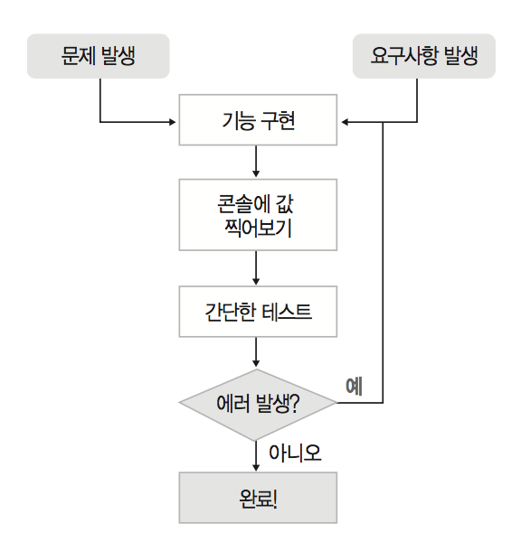
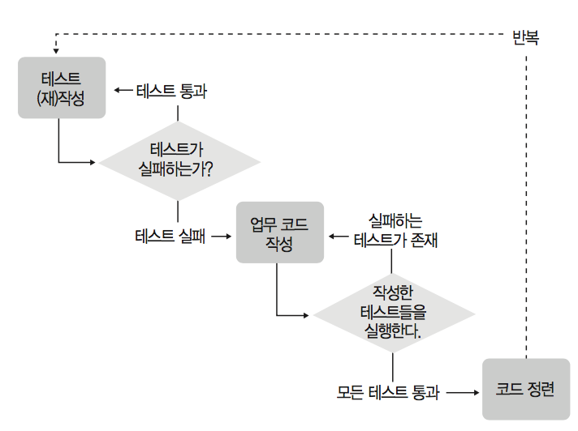

# [TDD] Ch1. 테스트 주도 개발(Test Driven Development)
> date - 2018.09.13  
> keyword - tdd  
> 테스트 주도 개발: 고품질 쾌속개발을 위한 TDD 실천번과 도구를 읽으며 공부했던 내용을 정리  
> 전통적인 SW 개발 방식의 문제점과 그중 TDD가 보완하는 부분, 적용시 장점을 알아보자  

<br>

TODO: 지워도 될듯?
## 체크 리스트
- [ ] TDD의 정의
- [ ] TDD의 목표
- [ ] 개발에 있어 TDD의 위치
- [ ] TDD의 진행 방식
- [ ] TDD의 장점

<br>

## 흔하디 흔한 소프트웨어 개발 방식
> 만일 당신이 때때로 실패하지 않는다면, 그건 안이하게 살고 있다는 확실한 증거다 - 우디 앨런   




머릿속이 평소보다 조금 복잡한 상태지만 개발을 진행하지 않을 수 없다
`작성자의 판단`에 근거한 개발은 중간 중간 결과를 확인하며 진행하고, `문제가 있으면, 나중에 테스트할 때 나오겠지~`라는 식으로 완료
나쁘지 않은 시나리오

어느 시점에 새로운 요구사항으로 인한 기능 추가/수정시 점점 더 복잡해지는 비즈니스 로직에 대한 검증이 필요

### 고전적인 개발 방식에서 쉽게 나타나는 몇가지 문제점
1. 특정 모듈의 개발 기간이 길어질수록 개발자의 목표의식이 흐려진다
어디까지 짯더라?
아, 내가 지금 뭘 하는 거였지?
이 모듈이 무슨 기능을 해야 한댓더라?
2. 작업 분량이 늘어날수록 확인이 어려워진다
로그가 어디 있더라?
이것도 화면으로 출력해보고..
3. 개발자의 집중력이 필요해진다
앗! 화면 지나갔다!
4. 논리적인 오류를 찾기 어렵다
여기서 그러니까 이값이 들어가면 나와야 하는게...아..이게 맞던가?
5. 코드의 사용 방법과 변경 이력을 개발자의 기억력에 의존하게 되는 경우가 많다
맞아! 개인고객 인증을 고치면 법인 고객인증 부분도 함께 고쳤어야 했었지!!
6. 테스트 케이스가 적혀있는 엑셀 파일을 보며 매번 테스트를 실행하는게 귀찮아져서는 점차 간소화하는 항목들이 늘어난다
날짜? 1111. 주빈번호? 222222-22222
7. 코드 수정시에 기존 코드의 정상 동작에 대한 보장이 어렵다
휴~ 찾았다. 여길 고쳐야 하는 거였군! 근데 다른데서도 사용하는거 아니야?
8. 테스트 해보려면 소스코드에 변경을 가하는 등, 번거로운 선행 작업이 필요할 수 있다
입고 처리를 테스트하려면, 주문이 완료됐다고 테이블에 직접 업데이트를 해줘야...
9. 그래서 소스 변경시 해야 하는 회귀 테스트(regression test)는 곧잘 희귀 테스트(rare test)가 되기 쉽다
아, 그걸 언제 다 다시 테스트해? 우선 급한 불부터 끄고 보자구. 집에 안갈꺼야?
10. 이래저래 테스트는 개발자의 귀중한 노동력(man-month)을 적지 않게 소모한다
QA 담당자 가라사대: 소스 수정사항 생기면 엑셀에 적힌 단위 테스트 다시 수행하는걸 절대! 빼먹지마!

> #### Regression Test
> 이미 개발과 테스트가 완료된 모듈에 수정을 가하게 될 경우  
> 기존에 동작하던 다른 부분도 정상적으로 동작하는지 확인하기 위해 수행하는 테스트  
> 원칙적으로 해당 모듈과 연관되어 있는 다른 모듈도 변함없이 동작하는지 매번 테스트해야 한다


TDD는 위와 같은 문제 발생의 확률을 낮춰줄 방법중 하나


<br>

## 테스트 주도 개발(TDD)
> Test the program before you write it. -Kent Beck

### TDD란?
* TDD를 주도한 켄트 벡은 `프로그램을 작성하기 전에 테스트를 먼저 작성하는 것`라고 정의
  * `업무 코드를 작성하기 전에 테스트 코드를 먼저 만드는 것!`
* 애자일 개발 방식 중 하나인 XP의 실천 방식 중 하나

> #### XP
> * 애자일 SW 개발 방법론의 하나로 단순성, 상호소통, 피드백, 용기 등의 원칙에 기반해 `고객에게 최고의 가치를 최대한 빨리 전달하는 것`이 목표
> * TDD, Unit Testing, Pair Programming, Daily Build, Automated Builds, Continuous Integration 등의 실천 방식이 있다

### sum()을 작성한다고 할 때

| | |
|:--|:--|
| 작성 메소드 이름 | sum |
| 기능 구현에 필요한 재료 | int a, int b |
| 반환 값의 타입 | int |
| 정상 동작 만족 조건 | a와 b를 더한 값을 결과로 돌려줌. 즉, sum(10, 15)는 25가 돼야 함 |

* 이런 설계문서를 아래의 코드로 표현
```java
public class Calculator {
    public int sum(int a, int b) {
        return 0;
    }

    public static void main(String[] args) {
        Calculator calc = new Calculator();
        System.out.println(calc.sum(10, 20) == 30);
        System.out.println(calc.sum(1, 2) == 3);
        System.out.println(calc.sum(-10, 20) == 10);
        System.out.println(calc.sum(0, 0) == 0);
    }
}
```
* `문서를 만들어 머리로 생각하고 눈으로 확인할 것인가?` 아니면 `예상 결과를 코드로 표현해놓고 해당 코드가 자동으로 판단하게 할 것인가?`의 차이

<br>

## TDD의 목표
> Clean code that works -론 제프리

* TDD를 통해 얻고자 하는 것은 `잘 동작하는 깔끔한 코드`
  * 제대로 동작할뿐 아니라 명확한 의미를 전달할 수 있게 깔끔하게 작성돼야 한다

<br>


## TDD의 위치
개발자 테스트
* 개발자가 처음으로 수행하는 테스트
unit test
    전통적 - 사용자 측면애서 기능 테스트
    TDD - 메소드 단위의 테스트
unit test 후 이후 통합 테스트, 인수 테스트 등에서 결함 발생 비용을 줄인다

> #### functional test
> 사용자 입장에 더 가까운 형태로 진행되는 기능들의 테스트
> 여러개의 단위 모듈이 합쳐져서 1개의 기능을 이루는 경우가 많다


## TDD의 진행 방식
질문(Ask) - 테스트 작성을 통해 시스템에 질문(테스트 수행 결과는 실패)
응답(Respond) - 테스트를 통과하는 코드를 작성해 질문에 대답(테스트 성공)
정제(Refine) - 아이디어를 통합하고, 불필요한 것은 제거하고, 모호한 것은 명확히 해서 대답을 정제(리팩토링)
반복(Repeat) - 다음 질문을 통해 대화를 계속 진행




## 클래스 설계시 속성을 먼저 고민해야 하지 않나?


## TDD의 장점
`자신이 얼마나 설계를 못하고 의존적이며 즉흥적인 코딩을 하고 있는지(=엉터리 개발자인지) 알게 된다`


