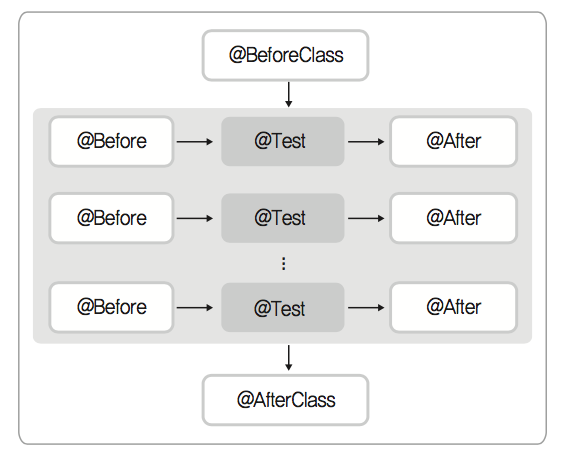

# [TDD] Ch2. JUnit과 Hamcrest
> date - 2018.09.20  
> keyword - tdd  
> 테스트 주도 개발: 고품질 쾌속개발을 위한 TDD 실천번과 도구를 읽으며 공부했던 내용을 정리  
> JUnit과 Hamcrest에 대한 내용을 요약  

<br>

## JUnit
* Java Unit Test Framework
* TDD의 근간이된 Framework
* 만들어진 방식, 구조에서 배울점이 많다
  * [JUnit A Cook's Tour](http://junit.sourceforge.net/doc/cookstour/cookstour.htm)에서 JUnit 라이브러리의 구조(디자인 패턴, 동작 원리)를 알 수 있다
* 다음과 같은 기능 제공
  * 테스트 결과가 예상과 같은지를 판별해주는 단정문(assertions)
  * 여러 테스트에서 공용으로 사용할 수 있는 Test Fixture
  * 테스트 작업을 수행할 수 있게 해주는 Test Runner

<br>

## Test Fixture
* 테스트를 반복적으로 수행할 수 있게 도와주고 매번 동일한 결과를 얻을 수 있게 도와주는 `기반이 되는 상태나 환경`
* 일관된 테스트 실행 환경
* test context
  * test case에서 사용할 객체 생성
  * DB 연결을 위한 참조 선언
  * 파일, 네트워크 등의 자원을 생성
* setUp, tearDown는 test fixture method
  * test fixture를 만들고, 정리하는 작업 수행
  * setUp
    * 각각의 `test method가 실행되기 전`에 공통으로 호출
    * 테스트 환경 준비(자원 할당, 객체 생성, DB 연결, 네트워크 연결 등)
  * tearDown
    * `test method 실행 후` 호출
    * 지원 해제, 연결 해제, 객체 초기화 등 `정리 작업`


<br>

## test case와 test method
* test case - test 작업에 대한 시나리오
* test method - JUnit의 메소드
* test case가 test method인 경우가 많아 혼용되어 사용


<br>

## 단정문
* JUnit은 테스트 케이스의 `수행 결과를 판별`해주는 다양한 단정문(무언가를 딱 잘라 한마디로 판단하는 짧은 문장) 제공
* `assertXXX` 형식

<br>

### assertEquals([message], expected, actual)
* expected와 actual이 같은지 비교

```java
static public void assertEquals(String message, Object expected, Object actual) {
    if (equalsRegardingNull(expected, actual)) {
        return;
    } else if (expected instanceof String && actual instanceof String) {
        String cleanMessage = message == null ? "" : message;
        throw new ComparisonFailure(cleanMessage, (String) expected,
                    (String) actual);
    } else {
        failNotEquals(message, expected, actual);
    }
}
```

#### assertEquals([message], double expected, double actual, double delta)
* float, double의 경우 오차가 생기는데 `delta`를 오차 보정 값을 이용해 적절한 범위 내의 값은 동일한 값으로 판단
* assertEquals(0.333, 1/3d, 0.0001);

<br>

### assertSame([message], expected, actual) / assertNotSame([message], expected, actual)
* 두 객체가 동일한 객체인지 `주소값`으로 비교
* 비교시 equals가 아닌 `==` 사용

```java
static public void assertSame(String message, Object expected, Object actual) {
    if (expected == actual) {
        return;
    }
    failNotSame(message, expected, actual);
}

static public void assertNotSame(String message, Object unexpected, Object actual) {
    if (unexpected == actual) {
        failSame(message);
    }
}
```

<br>

### assertTrue([message], expected) / assertFalse([message], expected)
* 예상 값의 참/거짓 판별
* assertTrue(account.getBalance() == 0) 가 실패하면 값을 바로 알 수 없어 불편
  * 등호 비교는 assertEquals(0, account.getBalance()) 를 권장

<br>

### assertNull([message], expected) / assertNotNull([message], expected)
* 대상 값의 null 여부 판단

```java
static public void assertNull(String message, Object object) {
    if (object == null) {
        return;
    }
    failNotNull(message, object);
}

static private void failNotNull(String message, Object actual) {
    String formatted = "";
    
    if (message != null) {
        formatted = message + " ";
    }
    fail(formatted + "expected null, but was:<" + actual + ">");
}
```

<br>

### fail([message])
* 해당 테스트 케이스를 즉시 실패시킨다
* 단정문 미작성시 초록불이 들어와 무심코 지나칠 수 있기 때문에 fail()을 추가해두면 좋다
```java
public void testAccumulatedCharge() throws Exception {
    Charge charge = new Charge(this.year);
    charge.add(additionalFee);
    // 이하 계산 로직 미작성 상태
}
```

* 특정 조건에서 예외가 발생해야 정상인 경우를 테스트 케이스로 작성
```java
public void testWithdraw() throws Exception {
    Account account = new Account(10000);
    try {
        account.withdraw(20000);
        fail();  // OverWithdrawRequestException 발생하지 않으면 실패
    } catch(OverWithdrawRequestException e) {
        assertTrue(true);
    }
}
```

<br>

## JUnut 4
* Annotation 지원

<br>

### test로 시작해야하는 메소드 이름 제약 해소
* `@Test` 사용으로 naming pattern의 제약에서 벗어났다
```java
// JUnit 3
public void testDeposit() throws Exception {
    account.deposit(1000);
    assertEquals(11000, account.getBalance());
}

// JUnut 4
@Test
public void deposit() throws Exception {  // test로 시작되지 않아도 된다
    account.deposit(1000);
    assertEquals(11000, account.getBalance());
}
```

<br>

### 유연한 Fixture
* @BeforeClass, @AfterClass, @Before, @After



```java
public class TerminalTest {

    private static Terminal terminal;

    @BeforeClass
    public static void setUpBeforeClass() throws Exception {
        terminal = new Terminal();
        terminal.netConnect();
    }

    @AfterClass
    public static void tearDownAfterClass() throws Exception {
        terminal.netDisConnect();
    }

    @Before
    public void setUp() throws Exception {
        terminal.logon("guest", "guest");
    }

    @After
    public void tearDown() throws Exception {
        terminal.logoff();
    }

    @Test
    public void terminalConnected() throws Exception {
        assertTrue(terminal.isLogon());
    }

    @Test
    public void getReturnMessage() throws Exception {
        terminal.sendMessage("hello");
        assertEquals("world!", terminal.getReturnMessage());
    }
}
```

<br>

### 예외 테스트
```java
// JUnit3
public void withdraw_현재잔고이상_인출요구시() throws Exception {
    Account account = new Account(10000);
    try {
        account.withdraw(20000);
        fail();  // OverWithdrawRequestException 발생하지 않으면 실패
    } catch(OverWithdrawRequestException e) {
        assertTrue(true);
    }
}

// JUnit4
@Test(expected = OverWithdrawRequestException.class)
public void withdraw_현재잔고이상_인출요구시() throws Exception {
    Account account = new Account(10000);
    account.withdraw(20000);
}
```

<br>

### 시간 제한 테스트
* 잔고 인출에 3초이상 걸리면 테스트 실패
```java
@Test(timeout = 3000)  // ms
public void withdraw_현재잔고이상_인출요구시() throws Exception {
    Account account = new Account(10000);
    account.withdraw(20000);
}
```

<br>

### test ignore
```java
@Test
@Ignore("this method isn't working yet")
public void withdraw_현재잔고이상_인출요구시() throws Exception {
    Account account = new Account(10000);
    account.withdraw(20000);
}
```

<br>

### @RunWith(XX.class)
* Test Runner 지정

#### Test Runner
* 테스트 클래스 내에 존재하는 각각의 테스트 메소드 실행을 담당하는 클래스
  * 테스트 클래스 구조에 맞게 테스트 메소드를 실행하고 결과를 표시
* 각 application, framework만의 고유 기능을 추가해 test runner를 만들어 제공
  * spring framework의 SpringRunner, SpringJUnit4ClassRunner
  * @Repeat, @IfProfileValue 등 사용 가능

```java
@RunWith(SpringRunner.class)
public class AccountTest {
}
```

<br>

### @SuiteClasses(Class[])
* 여러개의 테스트 클래스를 수행하기 위해 사용

```java
@RunWith(Suite.class)
@Suite.SuiteClasses({AccountTest.class, TerminalTest.class})
public class SuiteTest {
}
```

<br>

### 파라미터를 이용한 테스트
* 하나의 메소드에 다양한 테스트 값을 1번에 실행하고자 할 때 사용

```java
@RunWith(Parameterized.class)
public class FibonacciTest {
    
    @Parameterized.Parameters
    public static Collection<Object[]> data() {
        return Arrays.asList(new Object[][]{
            {0, 0}, {1, 1}, {2, 1}, {3, 2}, {4, 3}, {5, 5}, {6, 8}
        });
    }

    private int fInput;

    private int fExpected;

    public FibonacciTest(int input, int expected) {
        this.fInput = input;
        this.fExpected = expected;
    }

    @Test
    public void test() {
        assertEquals(fExpected, Fibonacci.compute(fInput));
    }
}

public class Fibonacci {

    public static int compute(int n) {
        if (n <= 1) {
            return n;
        }
        return compute(n - 1) + compute(n - 2);
    }
}
```
* 다른 예제는 [Parameterized tests - JUnut4](https://github.com/junit-team/junit4/wiki/parameterized-tests) 참고

<br>

### Rule
* 테스트 클래스 내에 각 테스트 메소드의 동작 방식을 overriding하거나 추가하기 위해 사용

| Name | Description |
|:--|:--|
| TemporaryFolder | test method 내에서만 사용 가능한 임시 폴더/파일 생성 |
| ExternalResource | 외부 자원을 명시적으로 초기화 |
| ErrorCollector | 실패에도 test를 중단하지 않고 진행할 수 있게 도와준다 |
| Verifier | test case와 별개의 조건을 만들어서 확인할 때 사용 |
| TestWatchman | test 실행 중간에 사용자가 끼어들 수 있게 도와준다 |
| TestName | test mothod의 이름을 알려준다 |
| Timeout | 일괄적인 timeout 설정 |
| ExceptedException | test case 내에서 예외와 예외 메시지를 직접 확인할 때 사용 |

<br>

### JUnit4 Sample Code
* before
```java
public class AccountTest {
    
    @Test
    public void testAccount() throws Exception {
        // TODO: 2018. 9. 22. 생성자 테스트 작성
        fail("not yet implement");
    }

    @Test
    public void testGetBalance() throws Exception {
        // TODO: 2018. 9. 22. 잔고 조회
        fail("not yet implement");
    }

    @Test
    public void testDeposit() throws Exception {
        // TODO: 2018. 9. 22. 예금 테스트
        fail("not yet implement");
    }

    @Test
    public void testWithdraw() throws Exception {
        // TODO: 2018. 9. 22. 인출 테스트
        fail("not yet implement");
    }
}
```

* after
```java
public class AccountTest {

    private Account account;

    @Before
    public void setUp() throws Exception {
        account = new Account(10000);
    }

    @Test
    public void testGetBalance() throws Exception {
        assertEquals(10000, account.getBalance());
    }

    @Test
    public void testDeposit() throws Exception {
        account.deposit(1000);
        assertEquals(11000, account.getBalance());
    }

    @Test
    public void testWithdraw() throws Exception {
        account.withdraw(1000);
        assertEquals(9000, account.getBalance());
    }
}
```

<br>

## Hamcrest
* Matcher 라이브러리
* 필터나 검색 등을 위해 값을 비교할 때 편리

```java
assertEquals("James", customer.getName());  // before
assertThat(customer.getName(), is("James"));  // after

assertEquals(100, account.getBalance());  // before
assertThat(account.getBalance(), is(equalsTo(10000)));  // after

assertNotNull(resource.newConnection());  // before
assertThat(resource.newConnection(), is(notNullValue()));  // after

assertTrue(account.getBalance() > 0);  // before
assertThat(account.getBalance(), isGreaterThan(0));  // after

assertTrue(user.getLoginName().indexOf("Guest") > -1);  // before
assertThat(user.getLoginName(), containsString("Guest"));  // after
```
* 문맥상 더 자연스러운 문장을 통해서 단정문(assertion)을 만드는 것이 Hamcrest 사용 목적

<br>

> #### 좋은 코드? 나쁜 코드?
> * 자연스럽게 읽힐 수 있는가
> * `분석한다`는 느낌이 들면 좋지 않은 소스, 소설책 읽듯이 문맥을 갖고 `쉽게 읽힌다`면 좋은 소스

---

<br>

> #### Reference
> * [2장 - JUnit and Hamcrest](https://repo.yona.io/doortts/blog/issue/3)
> * [Parameterized tests - JUnut4](https://github.com/junit-team/junit4/wiki/parameterized-tests)
