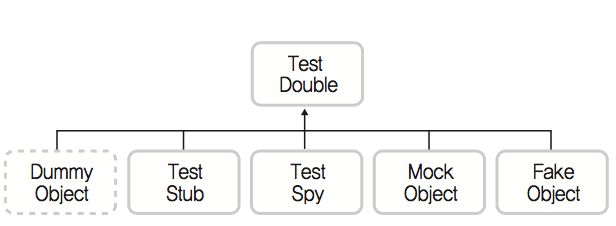
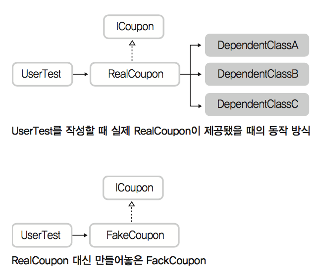
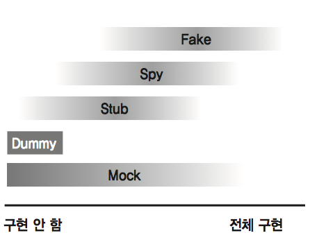

# [TDD] Ch4. Mock을 이용한 TDD
> date - 2018.09.30  
> keyword - tdd  
> 테스트 주도 개발: 고품질 쾌속개발을 위한 TDD 실천번과 도구를 읽으며 공부했던 내용을 정리  
> Mock을 이용한 TDD에 대한 내용 요약  

<br>

## Mock이란?
* 추후 만들어질 제품의 외양을 흉내낸 모조품
* Mock객체 - 완성될 모듈처럼 작동하도록 만든 `가짜 객체`
* 실제 모듈을 만들기엔 비용과 시간이 많이 들거나 의존성이 길게 걸쳐져 있어 제대로 구현하기 어려운 경우 사용

### Example - 사용자 암호 변경 기능 구현
* 암호는 MD5기반으로 암호화한 다음 저장
```java
// 암호화 모듈의 스펙은 정해져 있다
public interface Cipher {
    public String encrypt(String source);
    public String descrypt(String source);
}
```

```java
@Test
public void testSavePassword() thrwos Exception {
    // given
    UserRegister register = new UserRegister();
    Cipher Cipher = ???  // 아직 구현되지 않아 테스트 불가능
    String userId = "sweet88";
    String password = "potato";

    // when
    register.savePassword(userId, cipher.encrypt(password));

    // then
    String descryptedPassword = cipher.descrypt(register.getPassword(userId));
    assertEquals(password, descryptedPassword);
}
```
* 구현해야 하는 기능은 `사용자의 암호 변경`이지만 암호화 모듈이 구현되지 않아 컴파일이 안돼는 상황
* 암호화를 빼고 구현할수도 있지만, 그러면 암호화 기능 적용을 누락한 채 개발 상황
* Mock을 구현해서 사용
```java
public class MockMD5Cipher implements Cipher {

    @Override
    public String descrypt(String source) {
        return "potato";
    }

    @Override
    public String encrypt(String source) {
        return "dsfdsfjdsklj22u34....";
    }
}

@Test
public void testSavePassword() thrwos Exception {
    // given
    UserRegister register = new UserRegister();
    Cipher Cipher = new MockMD5Cipher();  // Mock 객체로 테스트
    String userId = "sweet88";
    String password = "potato";

    // when
    register.savePassword(userId, cipher.encrypt(password));

    // then
    String descryptedPassword = cipher.descrypt(register.getPassword(userId));
    assertEquals(password, descryptedPassword);
}
```

<br>

## 언제 Mock객체를 만들것인가?
* 테스트 케이스 작성이 어려운 상황과 Mock 객체가 필요한 상환은 종종일치 
* 대부분 모듈이 가진 `의존성`이 근본적인 원인
* 의존성을 단절시키기 위해 Mock 객체 사용

### 1. 테스트 작성을 위한 환경 구축이 어려워서
* 환경 구축을 위한 작업 시간이 많이 필요할 경우
  * DB, Web Server, FTP 서버 설치 등
* 의존성 모듈이 구현되지 않았을 경우
* 연계 모듈이라 계약, 정책 등 승인이 필요한 경우

### 2. 테스트가 특정 경우나 순간에 의존적이라서
* 특정 경우에 의존적으로 동작하는 기능 구현시 해당 상황을 만들기 어렵다
  * 예외처리 테스트시 많이 접한다
* FTP 클라이언트의 timeout 기능을 구현할 때
  * 접속시도 후 5초까지 1초마다 재시도. 4초에 접속되는 테스트 케이스 작성

### 3. 테스트 시간이 오래 걸려서
* 기능 수행 자체보다 테스트 수행시 영향을 미치는 다른 부분으로 인해 시간이 오래 걸리는 경우
  * 특정 모듈 호출시 멀리 갔다 오느라 시간이 오래 걸릴 때
  * 신뢰도 높은 모듈이라는 전제하에 Mock으로 대체

<br>

## Test Double
* 원본 객체로 테스트를 진행하기 어려울 경우 대신해서 테스트를 진행할 수 있도록 만들어주는 객체
  * 포괄적으로 Mock이라는 단어를 사용


Test Double 분류


### Sample Code
```java
public interface ICoupon {
    public String getName();  // 쿠폰 이름
    public boolean isValid();  // 쿠폰 유효 여부 확인
    public int getDiscountPercent();  // 할인률
    public boolean isAppliable(Item item);  // 해당 아이템에 적용 가능 여부
    public void doExpire();  // 사용할 수 없는 쿠폰으로 만듦
}

유저 ID를 기준으로 신규 유저 객체를 생성
-> 현재 쿠폰 확인
-> 신규 쿠폰 받기
-> 유저의 보유 쿠폰 개수 확인
```

```java
public class UserTest {

    @Test
    public void testAddCoupon() throws Exception {
        // given
        User user = new User("aaa99");
        assertEquals("쿠폰 수령 전", 0, user.getTotalCouponCount());

        ICoupon coupon = ???

        // when
        user.addCoupon(coupon);

        // then
        assertEquals("쿠폰 수령 후", 1, user.getTotalCouponCount());
    }
}
```

### Dummy Object
* 단순한 껍데기
* `인스턴스화될 수 있는 수준`으로만 구현
* 객체의 기능까지 필요하지 않은 경우 사용

```java
public class DummyCoupon implements ICoupon {

    @Override
    public int getDiscountPercent() {
        return 0;
    }

    @Override
    public String getName() {
        return null;
    }

    @Override
    public boolean isAppliable(Item item) {
        return false;
    }

    @Override
    public boolean isValid() {
        return false;
    }

    @Override
    public void doExpire() {
    }
}

@Test
public void testAddCoupon() throws Exception {
    // given
    User user = new User("aaa99");
    assertEquals("쿠폰 수령 전", 0, user.getTotalCouponCount());

    ICoupon coupon = new DummyCoupon();  // here

    // when
    user.addCoupon(coupon);

    // then
    assertEquals("쿠폰 수령 후", 1, user.getTotalCouponCount());
}
```

<br>

### Test Stub
* Dummy Object가 실제로 동작하는 것처럼 보이게 만들어놓은 객체
* `특정 상태를 가정`해서 구현
* 테스트시 필요한 조건을 하드코딩
  * 해당 테스트에서만 유효하다는 단점

```java
public class StubCoupon implements ICoupon {

    @Override
    public int getDiscountPercent() {
        return 7;
    }

    @Override
    public String getName() {
        return "VIP 고객 한가위 감사쿠폰"
    }

    @Override
    public boolean isAppliable(Item item) {
        return true;
    }

    @Override
    public boolean isValid() {
        return true;
    }
    ...
}

// 아래 같은 테스트만 통과한다
@Test
public void testGetOrderPrice_discountableItem() throws Exception {
    // given
    PriceCalculator calculator = new PriceCalculator();
    Item item = new Item("LightSavor", "부엌칼", 10000);
    ICoupon coupon = new StubCoupon();  // here

    // when
    int calculatedPrice = calculator.getOrderPrice(item, coupon);

    // then
    assertEquals("쿠폰으로 할인된 가격", 93000, calculatedPrice);
}
```

<br>

### Fake Object
* `여러개의 인스턴스를 대표`할 수 있거나 `Test Stub보다 복잡`한 구현이 들어간 경우
* 테스트 케이스 작성을 위해 필요한 다른 객체들과의 의존성 제거를 위해 사용
  * 객체 내부에서 필요로 하는 외부 객체들의 동작을 단순화하여 구현
* 너무 복잡하지 않게 적절한 수준에서 구현
  * 복잡해지면 Mock Framework를 사용



```java
// example - DB의 데이터랑 비교할 때와 동일하게 구현
public class FakeCoupon implements ICoupon {

    List<String> categories = new ArrayList<>();

    public FakeCoupon() {
        categories.add("부엌칼");
        categories.add("아동 장난감");
        categories.add("조리기구");
    }

    @Override
    public boolean isAppliable(Item item) {
        if(this.categories.contains(item.getCategory())) {
            return true;
        }
        return false;
    }
}
```

<br>

### Test Spy
* 예상한 메소드의 호출 수를 확인하기 위해 원래 객체의 기능을 하면서 메소드 호출을 기록하는 객체

```java
public class SpyCoupon implements ICoupon {

    List<String> categories = new ArrayList<>();
    private int isAppliableCallCount;
    
    @Override
    public boolean isAppliable(Item item) {
        isAppliableCallCount++;  // 호출되면 증가
        if(this.categories.contains(item.getCategory())) {
            return true;
        }
        return false;
    }

    public int getIsAppliableCallCount() {  // 몇 번 호출됐나?
        return this.isAppliableCallCount;
    }
}

@Test
public void testGetOrderPrice_discountableItem() throws Exception {
    // given
    PriceCalculator calculator = new PriceCalculator();
    Item item = new Item("LightSavor", "부엌칼", 10000);
    ICoupon coupon = new SpyCoupon();  // here

    // when
    int calculatedPrice = calculator.getOrderPrice(item, coupon);

    // then
    assertEquals("쿠폰으로 할인된 가격", 93000, calculatedPrice);

    int methodCallCount = ((SpyCoupon)coupon).getIsAppliableCallCount();
    assertEquals("coupon.isAppliable() 호출 수", 1,  methodCallCount);
}
```

<br>

> #### 상태 기반 테스트
> * 테스트 대상 메소드를 호출하고, `결과값을 예상값과 비교`
> ```java
> @Test
> public void stateBaseTest() throws Exception {
>     // given
>     OrderSheet orderSheet = new OrderSheet();
>     orderSheet.setOrderId(1L);
>
>     // when
>     orderService.addOrder(orderSheet);
>
>     // then
>     Order order = orderService.readOrder(1L);
>     assertEquals(1L, order.getOrderId());
> }
> ```

> #### 행위 기반 테스트
> * 메소드의 리턴값이 없거나 리턴값만으로 예상대로 동작했음을 보증하기 어려운 경우 사용
> * 시나리오에 따른 `특정 메소드 호출여부를 검증`
> * 상태 기반 테스트를 작성할 수 있는 상황이라면 행위 기반 테스트는 만들지 않는게 좋다
>   * 행위 기반 테스트는 복잡미묘한 시나리오가 사용되는 경우가 많기 때문
> ```java
> @Test
> public void behaviorBaseTest() throws Exception {
>     // given
>     OrderSheet orderSheet = new OrderSheet();
>     orderSheet.setOrderId(1L);
>
>     // when
>     orderService.addOrder(orderSheet);
>
>     // then     
>     verify(orderRepository, times(1)).save(anyObject());
> }
> ```

<br>

### Mock Object
* 행위를 검증하기 위해 사용되는 객체
  * 일반적인 test double은 상태 기반으로 테스트 케이스를 작성
  * Mock Object는 행위를 기반으로 테스트 케이스를 작성
* Test Double과 동등한 의미로 사용되는 경우가 더 많다
  * Mocking - Test Double 객체를 만든다



* Dummy - Mock Framework로 클래스 인스터스화 
* Stub - Dummy에 리턴값 돌려주도록 추가 
* Spy - Stub에 호출 확인 기능 사용 추가

<br>

## Mock 사용시 유의사항
* Mock Framework가 정말 필요한지 따져본다
  * Mock이 편해서 굳이 사용하지 않아도 되는데 사용하는 상황 발생
  * Mock 객체는 깨지기 쉬운 테스트 케이스가 돼버리는 경향이 있다
  * Mock이 필요없는 의존성 적은 구조로 만들기 권장
* 투자 대비 수익(ROI)가 확실할 때만 사용
  * 테스트용 DB 설치에 반나절이 걸릴 때 DB와 관련된 부분을 Mock으로 만드는 것이 합당한가?
  * Mock을 사용할 때는 좀 더 길게 볼 필요가 있다
  * 장기적으로 이득일지 고민
* 어떤 Mock Framework를 사용하느냐는 중요하지 않다
  * 어떤 Framework든 학습 비용 필요
  * 너무 고민하지 말자
* Mock은 Mock일 뿐이다
  * Mock은 단지 작성자가 원하는대로 흉내만 내는거기 때문에 `실제 객체가 들어왔을 때도 잘 동작하리라는 보장은 없다`
  * 초반부터 실제 객체를 테스트에 사용할 수 있고, 비용이 크지 않다면 `Mock 객체를 사용하지 말자`

> Mocking 대상이 되는 서버나 API, 데이터는 자주 변하지 않는 대상이 되어야 한다
> 개발중이라 API가 계속 바뀌는 경우 layering에 대한 mock 기반 테스트는 현실괴리만 높이는 경우가 생긴다

---

<br>

> #### Reference
> * [4장 - Mock을 이용한 TDD](https://repo.yona.io/doortts/blog/issue/5)
