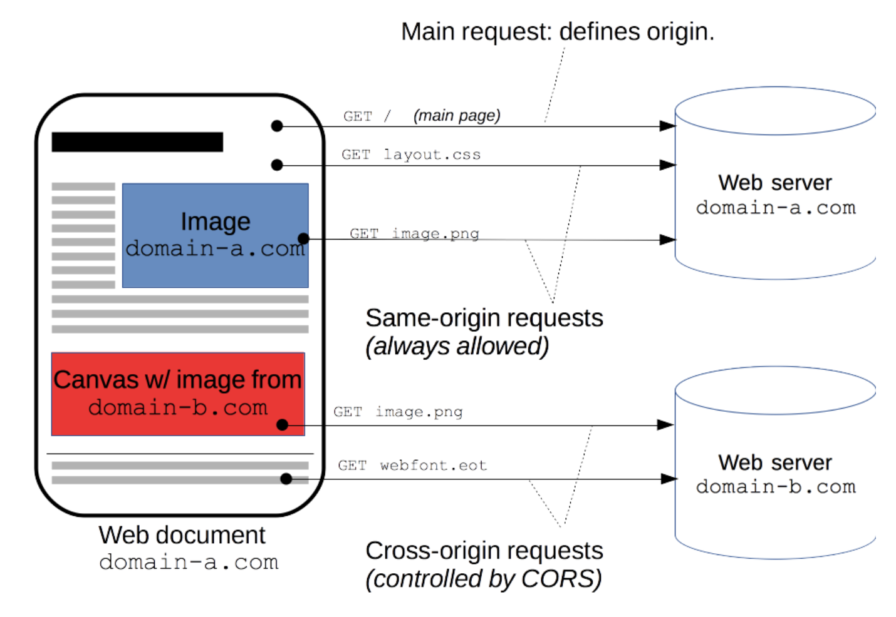
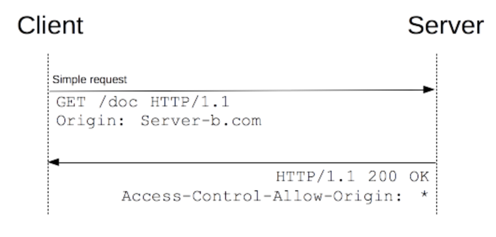
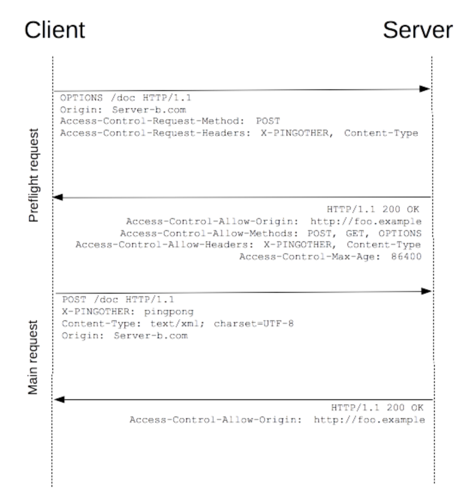
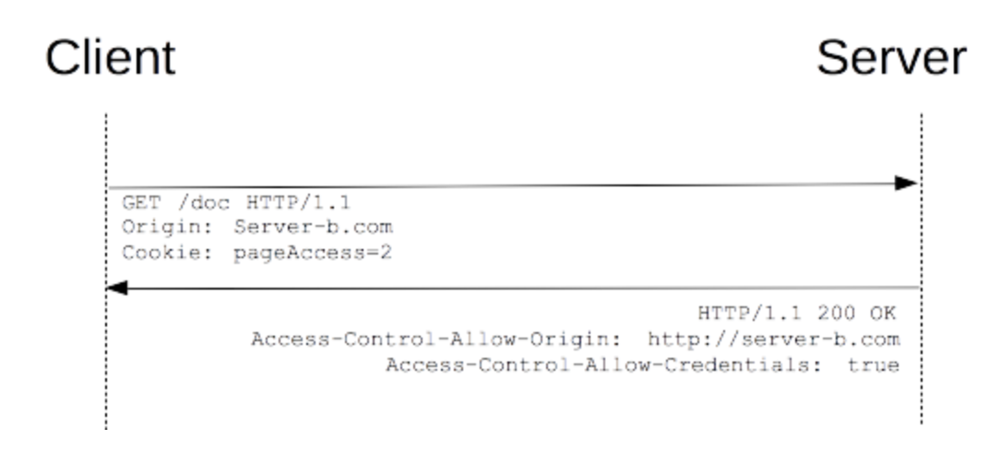

# [Web] Cross-Origin Resource Sharing(CORS)
> date - 2019.05.19  
> keyword - web, cors  
> 서로 다른 도메인을 가진 server에서(cross site) request시 마주칠 수 있는 cross origin resource sharing에 대해 알아보자  


<br>

## Cross Site HTTP Request
* 처음 전송되는 리소스의 도메인과 다른 도메인으로부터 리소스가 요청될 경우 **cross-origin HTTP request**에 의해 요청된다
* 종류
  * cross-site의 `XMLHttpRequest` API 호출
  * CSS내 @font-face에서 cross-domain web font 사용
  * WebGL textures
  * `drawImage()`로 canvas에 images/video frames drawing
  * CSS stylesheet
  * script
  * e.g. `http://domain-a.com`으로 전송된 HTML에서 ``를 사용하는 경우
* 보안상의 이유로 브라우저들은 script 내에서 초기화되는 cross-origin HTTP Request를 제한
* `XMLHttpRequest`와 [Fetch API](https://developer.mozilla.org/en-US/docs/Web/API/Fetch_API) `Same-origin policy`를 따르기에 동일한 도메인으로만 HTTP request 가능
* 이를 해결하기 위헤 [Cross-Origin Resource Sharing](https://www.w3.org/TR/cors/) 메커니즘을 사용해 브라우저와 web server간의 안전한 cross-origin request 및 데이터 전송을 지원

<br>



<br>

## Cross-Origin Resource Sharing?
* 브라우저가 사용하는 정보의 허가된 origin을 http response의 header를 통해 알려주도록 함으로써 동작
* 사용자의 데이터에 영향을 줄 수 있는 HTTP method(GET 이외)들에 대해 브라우저가 request를 `preflight`하도록 강제
* HTTP **OPTIONS** method를 사용해 origin과 method를 전송해 server에서 approval시에 real request를 전송
* server는 client에게 real request에 `credentials(Cookie와 HTTP Authentication 데이터)`의 필요 여부도 전달할 수 있다


<br>

## CORS의 종류
1. Simple Request
2. Preflighted Request
3. Credential Request


<br>

## 1. Simple Request
* GET, HEAD, POST 중 한가지 방식 사용
* Content-Type이 아래 중 하나를 만족
  * application/x-www-form-urlencoded
  * multipart/form-data
  * text/plain
* user agnet에 의해 자동으로 설정되는 header(Connection, User-Agent 등), 수동 설정이 허용되는 Fetch spec의 **CORS-safelisted request-header**
  * Accept
  * Accept-Language
  * Content-Language
  * Content-Type
  * DPR
  * Downlink
  * Save-Data
  * Viewport-Width
  * Width
* request에 사용된 `XMLHttpRequestUpload` 객체에 event가 등록되지 않고, `XMLHttpRequest.upload` 사용
* request에서 `ReadabbleStream` 객체를 사용하지 않는다


<br>



* CORS hedaer를 사용하여 권한을 처리하는 client와 server간의 간단한 교환이 이루어진다
```js
const invocation = new XMLHttpRequest();
const url = 'http://bar.other/resources/public-data/';

function callOtherDomain() {
  if(invocation) {
      invocation.open('GET', url, true);
      invocation.onreadystatechange = handler;
      invocation.send();
  }
}
```

* response의 **Access-Control-Allow-Origin**에 request의 **Origin**이 포함되야 한다
```
GET /resources/public-data/ HTTP/1.1
Host: bar.other
User-Agent: Mozilla/5.0 (Macintosh; U; Intel Mac OS X 10.5; en-US; rv:1.9.1b3pre) Gecko/20081130 Minefield/3.1b3pre
Accept: text/html,application/xhtml+xml,application/xml;q=0.9,*/*;q=0.8
Accept-Language: en-us,en;q=0.5
Accept-Encoding: gzip,deflate
Accept-Charset: ISO-8859-1,utf-8;q=0.7,*;q=0.7
Connection: keep-alive
Referer: http://foo.example/examples/access-control/simpleXSInvocation.html
Origin: http://foo.example  // here


HTTP/1.1 200 OK
Date: Mon, 01 Dec 2008 00:23:53 GMT
Server: Apache/2.0.61 
Access-Control-Allow-Origin: *  // here
Keep-Alive: timeout=2, max=100
Connection: Keep-Alive
Transfer-Encoding: chunked
Content-Type: application/xml
```


<br>

## 2. Preflighted Request
* preflight request는 `OPTION` method를 사용해 server의 response 확인
* preflight request success 후 실제로 request
* server에서 `Access-Control-Allow-xxxx` header로 request에서 허용되는 필드를 알려준다

<br>

### Preflighted Request를 하는 경우
* 아래의 HTTP method 사용
  * PUT
  * DELETE
  * CONNECT
  * OPTIONS
  * TRACE
  * PATCH
* user agnet에 의해 자동으로 설정되는 header(Connection, User-Agent 등)나 수동 설정이 허용되는 Fetch spec의 **CORS-safelisted request-header**이외의 header가 포함된 경우
  * Accept
  * Accept-Language
  * Content-Language
  * Content-Type
  * DPR
  * Downlink
  * Save-Data
  * Viewport-Width
  * Width
* 아래와 다른 `Content-Type`을 사용
  * `application/x-www-form-urlencoded`
  * `multipart/form-data`
  * `text/plain`
* request에 사용된 event listener가 하나 이상이고 `XMLHttpRequestUpload`에 등록
* request에서 `ReadabbleStream` 객체를 사용

<br>



* custom header와 `application/xml` Content-Type을 사용하기 때문에 preflighted request
```js
const invocation = new XMLHttpRequest();
const url = 'http://bar.other/resource/post-here';
const body = '<?xml version="1.0"?><persion><name>Arun</name></persion>';

function callOtherDomain() {
  if(invocation) {
      invocation.open('POST', url, true);
      invocation.setRequestHeader('X-PINGOTHER', 'paingpong');  // here
      invocation.setRequestHeader('Content-Type', 'application/xml');  // here
      invocation.onreadystatechange = handler;
      invocation.send(body);
  }
}
```

* preflighted request
```
// Request
OPTION /resource/post-here HTTP/1.1
Host: domain-b.com
Origin: http://domain-a.com
Access-Control-Request-Method: POST
Access-Control-Request-Headers: X-PINGOTHER, Content-Type

// Response
HTTP/1.1 204 No Content
Access-Control-Allow-Origin: http://domain-a.com
Access-Control-Allow-Methods: POST, GET, OPTIONS
Access-Control-Allow-Headers: X-PINGOTHER, Content-Type
Access-Control-Max-Age: 86400
```


<br>

### Preflighted request and redirects
* 모든 브라우저가 preflighted request 후 redirection을 지원하는게 아니라서 일부 브라우저에서 다음과 같은 error 발생
  * The request was redirected to 'https://domain.com', which is disallwed for cross-origin requests that require preflight
  * Request require preflight, which is disallwed to follow cross-origin redirect
* CORS protocol은 원래 위와 같은 기능이 필요했지만 더이상 필요 없어졌지만 모든 브라우저가 대응한게 아니므로 아래 방법으로 회피
  * server에서 preflight 후 redirect를 피해라
  * preflighted request를 하지 않게 `simple request`로 변경

> #### 위의 방법으로 회피 불가능하면?
> 1. preflight request가 끝날 url을 Fetch API의 `Response.url`이나 `XMLHttpRequest.responseURL`을 사용해 `simple request`로 변경
> 2. 1번째 단계에서 얻은 url로 real request를 만들어서 요청
> <br>
> * Authorization header로 인한 발생한 preflighted request는 위의 방법 사용 불가


<br>

## 3. Credential Request
* `XMLHttpRequest` 또는 `Fetch`와 `CORS`가 제공하는 가장 흥미로운 기능은 HTTP cookies와 HTTP Authentication 정보을 인식하는 credentialed(인증된) request를 만들어내는 기능
* 기본적으로 cross-site `XMLHttpRequest` 내에서 브라우저는 자격 증명을 보내지 않는다
* `XMLHttpRequest`객체의 `withCredentials` flag가 있어야 한다

<br>



* `Access-Control-Allow-Credentials: true` header를 갖고 있지 않은 response은 거절된다
```js
const invocation = new XMLHttpRequest();
const url = 'http://bar.other/resources/credentialed-content/';

function callOtherDomain() {
  if(invocation) {
    invocation.open('GET', url, true);
    invocation.withCredentials = true;  // here
    invocation.onreadystatechange = handler;
    invocation.send();
  }
}
```

```
// Request
GET /resources/access-control-with-credentials/ HTTP/1.1
Host: bar.other
Referer: http://foo.example/examples/credential.html
Origin: http://foo.example
Cookie: pageAccess=2
...

// Response
HTTP/1.1 200 OK
Access-Control-Allow-Origin: http://foo.example
Access-Control-Allow-Credentials: true
Vary: Accept-Encoding, Origin
...
```

<br>

### Credentialed request and wildcards
* Credential Request의 response은 도메인을 특정해야 해서 `*`를 사용할 수 없다
  * `Access-Control-Allow-Origin: *` - failure
  * `Access-Control-Allow-Origin: foo.com` - success


<br>

## HTTP Response header
* Cross-Origin Resource Sharing spec에 정의된대로 access controll에 사용될 response header

<br>

### Access-Control-Allow-Origin
```
Access-Control-Allow-Origin: <origin> | *
```
* `<origin>`은 리소스에 접근하는 URI를 지정
* credentials이 없는 request에 대해 server는 모든 URI를 허용하는 `*`를 사용
* server가 `*`가 아닌 single origin을 지정할 경우에는 response가 request header의 `Origin` 값과 다르다는 것을 알려주기 위해 response header의 `Vary`에 `Origin`을 포함해야 한다
```
Access-Conrol-Allow-Origin: http://mozilla.com
Vary: Origin
```

<br>

### Access-Control-Expose-Headers
* 브라우저가 access할 수 있도록 허용된 header
```
Access-Control-Expose-Header: <field-name>[, <field-name>]*
```

<br>

### Access-Control-Max-Age
* preflighted request의 결과를 cache할 수 있는 기간(seconds)
* cache하는 동안 다른 preflighted request를 하지 않아도 된다
* preflighted response의 cache는 `origin`이 아닌 [cors-preflight-cache - Fetch Spec](https://fetch.spec.whatwg.org/#cors-preflight-cache)에 따라 아래 5개 필드로 cache entry 구성
  * `byte-serialized origin` - The result of byte-serializing a request origin with request
  * `URL` - request’s current URL
    * URL path(query parameters 포함)가 다르면 preflighted request 발생
  * `max-age` - max-age
  * `credentials` - True if request’s credentials mode is "include", and false otherwise
  * `method` - method
  * `header name` - headerName
* 최상의 효율을 위해 가장 긴 시간으로 설정 
```
Access-Control-Max-Age: <delta-seconds>
```

<br>

### Access-Control-Allow-Credentials
```
Access-Control-Allow-Credentials: true | false
```
* `credentials` flag가 true인 경우 request에 대한 response를 내보낼 수 있는지 없는지의 여부를 나타낸다
* preflighted request의 response인 경우, real request의 credential 사용 여부를 나타낸다
* 간단한 GET request가 preflighted request되지 않았고, credential request고, header가 리소스와 함께 반환되지 않은 경우, response는 브라우저에 의해 무시되며 web content를 반환하지 않는다

<br>

### Access-Control-Allow-Methods
```
Access-Control-Allow-Methods: <method>[, <method>]*
```
* preflighted request의 response로 사용, **real request시 리소스에 접근이 허용되는 HTTP method** 지정

<br>

### Access-Control-Allow-Headers
```
Access-Control-Allow-Headers: <field-name>[, <field-name>]*
```
* preflighted request의 response로 사용, **real request시 사용될 수 있는 header**를 지정


<br>

## HTTP Request header
* Cross-Origin Resource Sharing spec에 따라 client가 사용할 수 있는 header 나열
* client에서 설정 필요
* cross-site `XMLHttpRequest`를 사용하면 어떤 cross-origin sharing request header를 설정하면 안된다

<br>

### Origin
```
Origin: <origin>
```
* cross-site access 또는 preflighted request의 origin을 나타낸다
* origin
  * request가 초기화된 곳에서 server를 가리키는 URI
  * 어떠한 path 정보도 포함되지 않고, **server name만 포함**
  * null일 수 있다
* 모든 access control request에 `Origin` header가 항상 전송된다

<br>

### Access-Control-Request-Method
```
Access-Control-Request-Method: <method>
```
* preflighted request시 real request에 사용될 HTTP method를 지정

<br>

### Access-Control-Request-Headers
```
Access-Control-Request-Headers: <field-name>[, <field-name>]*
```
* preflighted request시 real request에 사용될 header를 지정


<br>

## 해결 방법

### 1. CORS header
* resource server의 response header에서 `Access-Control-Allow-Origin` 등의 CORS header를 포함시켜 준다
* resource server의 변경 필요
* **best** solution

#### Usage Cross Origin
```
// Request
OPTIONS /sample HTTP/1.1
Origin: http://a.com

// Response
Access-Control-Allow-Origin: http://a.com
// or Access-Control-Allow-Origin: *
```

#### Usage Custom header
* `Authorization` header 사용시
```
// Request
OPTIONS /sample HTTP/1.1
Origin: http://a.com
Access-Control-Request-Method: POST
Access-Control-Request-Header: Authorization

// Response
HTTP/1.1 200 OK
Access-Control-Allow-Origin: http://a.com
Access-Control-Allow-Method: POST, GET, OPTIONS
Access-Control-Allow-Header: Authorization
```


<br>

### 2. Proxy Server
* proxy server를 사용해 server to server로 진행되므로 브라우저의 preflighted request를 피할 수 있다
* resource server의 변경 불필요
* 추가적으로 proxy server의 구성 필요


<br><br>

> #### Reference
> * [Cross-Origin Resource Sharing (CORS) - MDN web docs](https://developer.mozilla.org/en-US/docs/Web/HTTP/CORS)
> * [cors-preflight-cache - Fetch Spec](https://fetch.spec.whatwg.org/#cors-preflight-cache)
