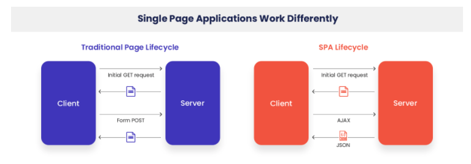
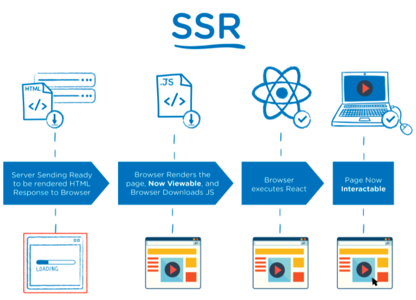
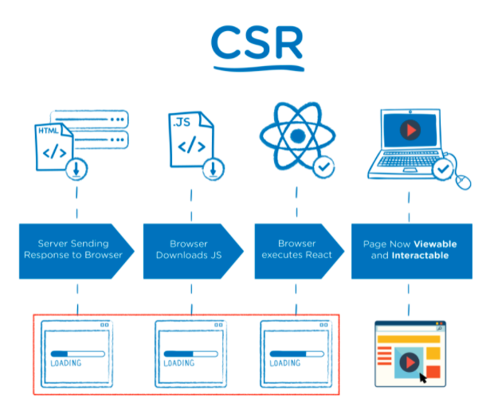
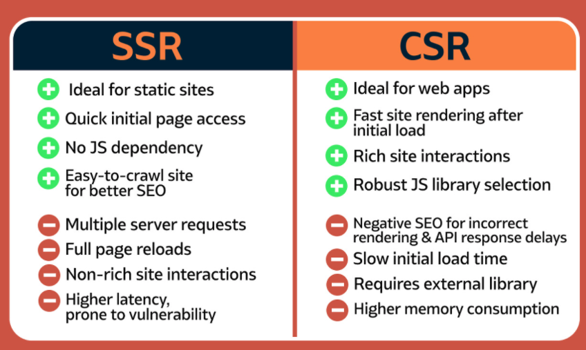

# [Web] SSR vs CSR
> date - 2022.02.18  
> keyworkd - web, frontend, ssr, csr, next.js  
> server side rendering, client side rendering에 대해 정리  

 

## SPA(Single Page Application)

  

 

### Traditional Page Lifecycle
1. client가 server로 request
2. server가 응답하면 client에 보인다
3. 이 과정을 반복하며 reloading

지속적인 reloading UX(+ 비용)에 좋지 않다

 

## SSR(Server Side Rendering)

  

server에서 rendering하기 때문에 유저 초기 로딩 속도가 굉장히 빠르고, 검색엔진 최적화(SEO)에 유리  
Next.js 등으로 쉽게 구현 가능

 

### 장점
* CSR에 비해 rendering 속도가 빨라 유저가 기다리는 loading 시간이 짧다
* SEO가 쉽다

 

### 단점
* SSR을 위한 server가 필요하다
* 페이지 전환시 reloading 발생
  * UX적으로 깜빡깜빡거린다

 

> #### Next.js 동작 방식
> 1. 유저의 초기 접근시 SSR 방식으로 rendering한 HTML 전달
> 2. 브라우저에서 JavaScript를 다운로드하고 React 실행
> 3. 유저, 페이지가 상호작용하여 다른 페이지 이동시에는 CSR 방식으로 브라우저에서 처리

 

## CSR(Client Side Rendering)

  

client에서 서비스에 필요한 resource를 다운로드 받은 후 rendering  
SSR보다 초기 로딩 속도는 뒤쳐질 수 있지만, 첫 페이지를 로딩하면서 모든 파일을 다운로드하기 때문에 페이지를 이동할 때마다 해당 페이지에서 필요한 data만 불러서 사용

 

### 장점
* component 단위로 UI를 구성하여 재사용성을 높이고, 중복을 제거할 수 있다
* 유저 입장에서 페이지 전환이 자연스럽다
* 변경된 부분에 필요한 server request만 발생하므로 비용 효율적이다

 

### 단점
* 초기 페이지 loading 속도가 SSR에 비해 느리다
* SEO가 어렵다

 

## SSR vs CSR

  

  

> #### Reference
> * [The Benefits of Server Side Rendering Over Client Side Rendering](https://medium.com/walmartglobaltech/the-benefits-of-server-side-rendering-over-client-side-rendering-5d07ff2cefe8)
> * [Rendering on the Web](https://developers.google.com/web/updates/2019/02/rendering-on-the-web)
