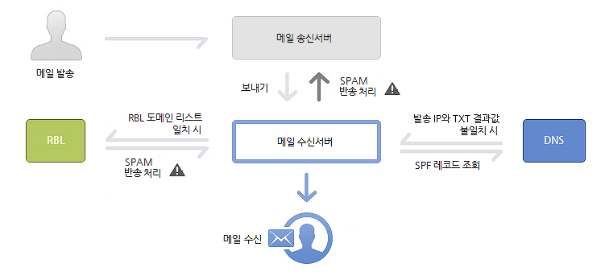

# [Email] About SPF, DKIM
> date - 2021.05.04  
> keyworkd - email, security, spf, dkim, dmarc  
> Email 인증에 사용하는 SPF, DKIM에 대해 정리  


<br>

## Email 도메인 인증하기
* 비공개 Email relay 서비스를 통해 전송된 outbound mail은 `SPF(Sender Policy Framework)` 및 `DKIM(DomainKeys Identified Mail)` protocol 인증 필요
* Spam 방지 및 등록된 source(mail address, mail domain)에서만 사용자에게 전송되도록 하기 위함
* 가능한 경우 SPF, DKIM을 모두 사용하여 outbound mail을 인증 권장

<br>

> #### Spam
> * 불특정 다수에게 수신 동의 없이 일방적으로 유포하는 mail
> * 원치 않는 사용자에게 대량 발송되어 사용자들의 불편과 network traffic 부하 발생

<br>

### Email 인증 권장 사항
* 도메인에 대해 항상 다음과 같은 Email 인증 방법을 설정하는 것이 좋다

#### SPF(Sender Policy Framework)
* 특정 도메인에서 전송된 것처럼 보이는 mail이 도메인 소유자가 승인한 서버에서 전송되었는지 확인 가능

#### DKIM(DomainKeys Identified Mail)
* **발신자가 암호화 키를 사용하여 email message에 signature할 수 있는 표준**
  * 모든 발신 mail의 header에 암호화된 디지털 서명 추가
* Email Provider는 signature을 사용하여 message의 변조 여부를 판단
  * `DKIM-Signature` header를 이용해 판단
    * DKIM을 사용하여 전송되는 email message에 message에 대해 암호화된 signature가 포함
    * message를 수신하는 Email Provider는 발신자의 DNS record에 게시된 public key를 사용해 signature를 decoding하여 진본 여부 확인

#### DMARC(Domain-based Message Authentication, Reporting & Conformance)
* SPF 및 DKIM을 사용하여 메일을 인증하고 의심스러운 수신 메일을 관리할 수 있다
* 도메인을 공격자가 Spoofing하는 것을 방지


<br>

## SPF(Sender Policy Framework)

<div align="center">
  
</div>

* **Email Spoofing 방지를 위한 Email 검증 표준**
  * 도메인의 Email을 보내도록 승인된 mail server를 지정하는 Email 인증 방법
  * DNS 기반의 기술
  * Domain owner는 SPF를 사용하여 도메인에서 Email을 전송하는데 허용된 서버를 Email Provider에게 알린다
  * [RFC 7208](https://tools.ietf.org/html/rfc7208)에 정의
* SPF를 사용하는 메일 서버에서는 특정 도메인에서 전송된 것처럼 보이는 메일이 실제로 해당 도메인에서 전송된 것인지 확인할 수있다
  * mail을 발송한 도메인에 대해 실제로 정상적인 도메인에서 발송되었는지 query를 통해 처리
  * 메일 발송자의 DNS server에 query하여 정상 mail인지 판단
* SPF를 사용하지 않는 경우
  * 수신 mail server는 내 도메인에서 전송된 것처럼 보이는 mail이 실제로 누가 보낸 것인지 확인할 수 없다
  * 수신 server에서 수신자의 Spam folder로 유효한 mail을 분류하거나, 수신 거부할 수 있다


<br>

### 필요성
* Spoofing 방지
  * Spoofing으로부터 도메인을 보호하고 mail이 올바르게 전송되도록 할 수 있다
  * SPF 사용시 내 도메인에서 보낸 메일이 실제 내 조직에서 발송된 메일이고, 내가 승인한 메일에서 보낸 것인지 수신 메일 서버에서 확인 가능
* Spam 분류 방지
  * 내 도메인에서 보낸 mail이 Spam으로 분류되는 것을 방지할 수 있다

<br>

> #### Spoofing
> * Spam 발송자는 도메인 도메인/조직을 위조하여 조직 내에서 전송된 것처럼 보이도록 위조 mail을 발송
> * 잘못된 정보 전달, 유해한 SW 전달 등 악의적인 목적으로 사용


<br>

## SPF record
* mail 수신을 허용할 mail server를 도메인으로 식별하는 DNS record
* 수신 mail server는 보낸 mail address로 부터 취득한 도메인 정보로 DNS record를 SPF record와 비교하여 spam mail 여부를 판단할 수 있다
* 도메인에 SPF를 사용설정 하려면 **SPF DNS TXT record 수정** 필요
  * TXT record - 도메인 외부의 서버 및 기타 소스에 대한 text 정보가 포함된 DNS record type

<br>

### SPF record format
* 다수의 tag(mechanism)와 value가 한줄로 나열된 text 형식
* 선택적으로 사용할 수 있는 `Qualifier`라는 tag는 mechanism이 일치할 때 수행할 작업을 정의

#### Example
* 192.168.0.1 ~ 192.168.255.255 사이에 있는 모든 주소를 허용
```
v=spf1 ip4:192.168.0.1/16 -all
```
* 메일을 보내지 않는 도메인이 있는 경우 SPF record를 사용해 스푸핑 방지
```
v=spf1 -all
```

<br>

### SPF용 TXT record mechanism
* mechanism - **SPF record를 만드는데 사용되는 tag**
* SPF record는 `a`, `mx`, `include`를 사용해 최대 10회 조회가 가능
  * 10회가 넘어가면 SPF 인증 검사를 통과하지 못해 spam으로 분류될 수 있다

| Mechanism | Description |
|:--|:--|
| v | SPF version <br> `spf1` 사용 <br> required tag로 1번재에 작성 |
| ip4 | IPv4 address(or range)로 mail server를 지정 <br> e.g. ip4:192.168.0.1 |
| ip6 | IPv6 address(or range)로 mail server를 지정 <br> e.g. ip6:3FFE:0000:0000:0001:0200:F8FF:FE75:50DF |
| a | 도메인 이름으로 mail server를 지정 <br> e.g. a:solamora.com |
| mx | Mx record를 참조하거나 하나 이상의 메일 서버를 지정 <br> e.g. mx:mail.solamora.com <br> optional로 지정하지 않으면 해당 도메인의 MX record를 사용 |
| include | 자사 도메인이 아닌 다른 도메인의 메일 서버를 지정 <br> e.g. include:amazonses.com <br> 3rd party mail service를 허용할 때 사용 |
| all | 마지막 tag로 사용 <br> SPF 검사는 이후의 모든 mechanism을 무시 <br> Soft fail(조건 비승인) 한정자인 `~all`과 함께 사용하는게 좋다 |

<br>

### SPF용 TXT record qualifier
* SPF record에서 **mechanism이 일치할 때 수행할 작업을 정의**
* SPF record에 `~all`을 사용하는게 좋다

| Qualifier | Description |
|:--|:--|
| + | Pass(통과) <br> mail을 전송하도록 승인되었다를 뜻함 <br> qualifier를 사용하지 않으면 default로 Pass로 설정 |
| - | Fail(비승인) <br> mail을 전송하도록 승인되지 않았다를 뜻함 <br> SPF record에 발신 server IP address, domain이 포함되어 있지 않다 |
| ~ | Soft fail(조건 비승인) <br> mail을 전송하도록 승인되었을 수도 있다를 뜻함 <br> 수신 서버에서 일반적으로 mail을 허용하고 의심스러운 mail로 표시 |
| ? | Neutral(판정 없음) <br> mail을 전송하도록 승인되었다고 명시되지 않았다를 뜻함 <br> 결과가 `Neutral`로 이어지는 SPF record에는 일반적으로 `?all`가 포함 |


<br>

### 현재 SPF record 확인 하기
G Suite toolbox의 Check MX App을 사용하여 확인

1. [Check MX App - G Suite Toolbox](https://toolbox.googleapps.com/apps/checkmx/)로 이동
2. 도메인 입력
3. 확인 실행 클릭
4. `유효한 SPF 주소 범위입니다` 클릭
5. SPF 결과 확인. 결과에 다음이 포함되어 있어야 한다
```
_spf.google.com
_netblocks.google.com
    여러 IP 주소
    ...
_netblocks2.google.com
    여러 IP 주소
    ...
_netblocks3.google.com
    여러 IP 주소
    ...
```


<br>

## SPF 적용하기

### 1. SPF record 만들기
* 도메인에서 메일을 전송할 수 있는 메일 서버를 정의

#### 3rd party mail service에서 제공하는 record 이용
* 모든 Email이 Gmail에서 전송되는 경우
```
v=spf1 include:_spf.google.com ~all
```

#### SPF record의 서버 정보
* SPF record를 정의하려면 **mail server에 대한 정보가 필요**
* 모든 mail server의 IP address
  * 사내 mail server(e.g. Microsoft Exchange)
  * 3rd party mail service의 mail server
* 조직에서 관리하는 모든 도메인
  * Email을 전송하지 않는 도메인을 포함하여 조직에서 관리하는 모든 도메인을 확인
  * SPF로 발신 도메인이 보호되면 Spam 발송자는 메일을 전송하지 않는 도메인을 Spoofing하려고 시도할 수 있다

<br>

### 2. 도메인에 SPF 사용 설정하기
* DNS TXT record 추가
| Record Name | Type | Value |
|:--|:--|:--|
| example.com | TXT | v=spf1 include:_spf.google.com ~all |

<br>

## SPF record troubleshooting
### 메일의 SPF 통과 확인하기
* 도메인의 Mail이 SPF를 통과(SPF record가 제대로 작동)하는지 확인하려면 도메인에서 전송된 메일을 확인
* Mail의 header에서 SPF result 확인

<br>

### SPF reocrd의 DNS 조회 확인하기
* SPF record에 대한 조회는 최대 10회로 제한
  * 10회를 초과할 경우 도메인에서 전송된 메일이 수신 서버의 SPF 검사를 통과하지 못하고 spam으로 분류될 수 있다
* SPF record에서 `a`, `mx`, `include`, `ptr` tag의 각 instance는 1회의 조회를 생성
  * 중첩된 조회도 10회 한도에 포함
  * `include` tag에 참조된 도메인에 SPF record의 도메인 참조가 있는 경우 해당 도메인도 한도에 합산된다
* mail이 계속 spam으로 분류되는 경우 [Check MX App - G Suite Toolbox](https://toolbox.googleapps.com/apps/checkmx/)에서 조회수 확인

<br>

### query count 최적화하기
* 필요한 경우가 아니라면 `include`는 사용하지 않습니다
* 가능하면 `include` 대신 `ip4`, `ip6` tag를 사용
* 중복 tag, 동일한 도메인을 참조하는 tag를 삭제
* Email을 주로 전송하는 도메인만 참조
  * 도메인의 Email을 전송하지 않는 서비스의 `include` 구문을 제거


<br>

---

## Amazon SES에서 SPF, DKIM을 사용하여 Email 인증
* Amazon SES를 통해 Email을 보내는 경우, 발송된 메시지는 기본적으로 SPF 검사를 통과
* Amazon SES는 amazonses.com의 하위 도메인인 각 메시지에 대해 MAIL FROM 도메인을 지정하고 message에 대한 발신 메일 서버는 이 도메인에 맞춰진다
  * 자체 SPF record 생성하면 `DMARC(Domain-based Message Authentication, Reporting and Conformance)`를 준수할 수 있다

<br>

### SPF record 추가
* 기존 SPF record가 없는 경우 다음 값의 TXT record를 추가
* record name은 DNS service에 따라 `공백` 또는 `@`일 수 있다
```
"v=spf1 include:amazonses.com ~all"

## multi include
"v=spf1 include:example.com include:amazonses.com ~all"
```

### Amazon SES에서 DKIM을 사용하여 Email 인증
3가지 방법이 있지만 간편하게 Easy DKIM 사용 추천
* Amazon SES가 모든 message에 DKIM signature를 자동으로 추가하도록 sending identity 설정
  * [Amazon SES에서의 Easy DKIM](https://docs.aws.amazon.com/ko_kr/ses/latest/DeveloperGuide/send-email-authentication-dkim-easy.html) 참조
* DKIM 인증에 자체 public-private key pair를 사용
  * [Amazon SES에 자체 DKIM 인증 토큰 제공](https://docs.aws.amazon.com/ko_kr/ses/latest/DeveloperGuide/send-email-authentication-dkim-bring-your-own.html) 참조
*  `SendRawEmail` API를 사용하여 전송하는 이메일 자체에 DKIM signature를 추가
  * [Amazon SES에서 수동으로 DKIM signature](https://docs.aws.amazon.com/ko_kr/ses/latest/DeveloperGuide/send-email-authentication-dkim-manual.html) 참조


<br>

### Amazon SES에서 Easy DKIM
* identity에 Easy DKIM을 설정하면 Amazon SES는 해당 identity에서 보내는 모든 email에 DKIM(1024 bit) key를 자동으로 추가한다

#### 고려 사항
* `From`에 사용하는 도메인에서만 Easy DKIM을 설정
  * `Return-Path`, `Reploy-to` address에 사용하는 도메인에 대해서는 설정하지 않아도 된다
* Amazon SES를 사용하는 **region마다 Easy DKIM 설정 필요**
* 상위 도메인, 하위 도메인, email address에 Easy DKIM을 설정하는 경우 아래와 같이 적용
  * Email address -> 하위 도메인 -> 상위 도메인의 우선 순위로 적용
  * Email address, 하위 도메인에 설정되지 않을 경우 상위 도메인의 설정 사용


<br><br>

> #### Reference
> * [APPLE로 로그인 - 비공개 이메일 릴레이 서비스 구성하기](https://help.apple.com/developer-account/#/devf822fb8fc)
> * [SPF로 메일 전송 확인 및 스푸핑 방지하기](https://support.google.com/a/answer/33786?hl=ko)
> * [DMARC에 관한 정보](https://support.google.com/a/answer/2466580)
> * [Amazon SES 이메일이 SPF 일치 또는 DKIM 일치의 DMARC 확인에 실패하면 어떻게 해야 합니까?](https://aws.amazon.com/ko/premiumsupport/knowledge-center/ses-dmarc-spf-dkim-alignment/)
> * [Check MX App - G Suite Toolbox](https://toolbox.googleapps.com/apps/checkmx/)
> * [Amazon SES에서 SPF를 사용하여 이메일 인증](https://docs.aws.amazon.com/ko_kr/ses/latest/DeveloperGuide/send-email-authentication-spf.html)
> * [Amazon SES에서 DKIM을 사용하여 이메일 인증](https://docs.aws.amazon.com/ko_kr/ses/latest/DeveloperGuide/send-email-authentication-dkim.html)
