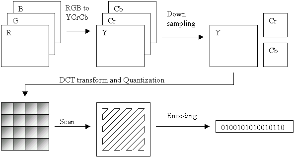

# [Image] WebP vs JPG vs PNG
> date - 2021.04.08  
> keyworkd - image format, webp, jpg, png  
> webp, jpg, png에 대해 알아본 것을 정리

 

## WebP
* 2010년 Google에서 만든 이미지 포맷
* Web을 위해서 만들어진 효율적인 이미지 포맷
* 이미지 포맷만 최적화해도 서버 트래픽이 크게 줄어 비용 절감에 효율적
* GIF, PNG, JPEG를 대체 가능
  * Google의 서비스는 Web browser 확인 후 WebP를 지원하면 JPEG, PNG 대신 WebP를 응답
* VP8 비디오 코덱 기반의 영상 압축 방식 사용
  * 손실/비손실 압축 모두 지원하며 약 30% 정도 용량 감소 효과가 있다
* Animated WebP로 애니메이션을 지원

 

## JPEG(Joint Photographic Experts Group)
* JPG, JPEG라고 부른다
* 용량이 큰 이미지를 작게 만들어 쉽게 공유할 수 있도록한 포맷
* JPG로 변환시 **압축 손실**되어(불필요한 정보 삭제) 이미지의 품질이 일부 저하된다
* 사람의 눈에 거슬리지 않을 정도로 원본을 훼손해 압축 효과를 극대화시키는 알고리즘
  * DCT(discreate cosine transform) 후 데이터를 줄이기 위해 Quantization(양자화)
  * Quantization - 자연스러운 색상을 단순화시키는 역할, 색의 갯수가 감소한다(데이터 손실)

 

  

 

## PNG
* GIF의 대안으로 개발
* **이미지의 투명성을 지원**하여 icon, watermark에 사용
  * e.g. 투명한 배경 이미지
* 무손실 압축으로 **압축 손실이 없다**
* JPG 보다 많은 정보를 포함하기 때문에 복잡한 이미지에 PNG를 사용
* 용량 대비 화질이 더 좋다

 

## Conclusion
* 이미지 품질이 중요하다면 압축 손실이 없는 PNG를 사용
* 이미지 파일이 가벼워야 한다면 JPG를 사용

  

> #### Reference
> * [WebP - Wiki](https://ko.wikipedia.org/wiki/WebP)
> * [WebP - Google Develope](https://developers.google.com/speed/webp)
> * [JPEG - Wiki](https://ko.wikipedia.org/wiki/JPEG)
> * [PNG - Wiki](https://ko.wikipedia.org/wiki/PNG)
