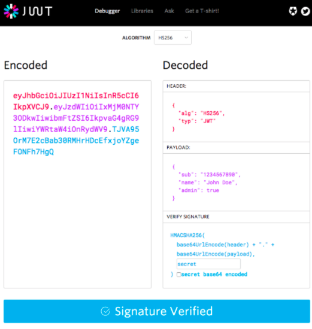
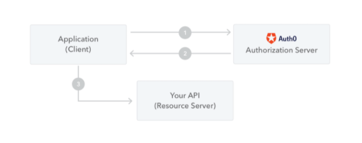
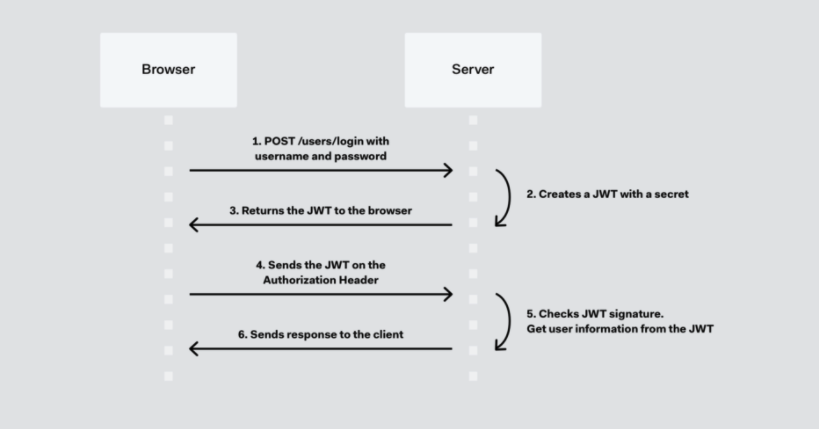

# [Web] JWT(Json Web Token)
> date - 2021.05.16  
> keyworkd - jwt, web, authentication, authorization  
> web service 인증시에 많이 사용하는 jwt에 대해 정리  

<br>

## JWT(Json Web Token)란?
* `RFC 7519`로 등록
* JSON object를 이용하여 정보를 안전하게 전달하기 위한 방식
* 특징으로 **compact, self-contained**가 있다
  * Compact
    * **압축을 이용해** size가 작기 때문에 전송 속도가 빠르다
  * Self-contained
    * token의 **payload에 필요한 정보를 담을 수 있어** DB query를 줄일 수 있다
* signed token(digitally sign된 token)으로 `claims`의 무결성을 보장
  * secret(HMAC algorithm) 또는 public/private key(RSA, ECDSA) pair로 sign


<br>

## JWT를 사용하는 경우

### Authorization
* 로그인 이후의 모든 request에 JWT가 포함되어 허용된 resource에 access할 수 있다
  * e.g. SSO(Single Sign On) - 작은 overhead와 여러 도메인에서 쉽게 사용할 수 있는 기능
* 가장 일반적인 시나리오

<br>

### Information Exchange
* public/private key pair를 이용한 sign을 통해 sender 확인이 가능하여 정보를 안전하게 전달할 수 있다
* header와 payload를 사용하여 sign되므로 content 변조도 검증 가능


<br>

## JWT structure
* compact form, JSON으로 `.`으로 구분된 3가지 부분으로 구성
  * Header
  * Payload
  * Signature
  * e.g. xxxxx.yyyyyyy.zzzzzz
* `SAML`과 같은 XML-based 표준에 비해 간결

<div align="center">
  
</div>

<br>

### Header
```json
{
  "alg": "HS256",
  "typ": "JWT"
}
```
* JWT의 1번째 부분
* **token type**과 **signing algorithm**(HMAC SHA256, RSA)을 가지고 있는 JSON을 `Base64Url`로 encoding
<br>

### Payload
```json
{
  "sub": "12345677890",
  "name": "John Doe",
  "admin": true
}
```
* JWT의 2반째 부분
* entity(typically, the user), additional data인 `Claims`을 가지고 있는 JSON을 `Base64Url`로 encoding
* 무결성(변조 방지)이 보장되지만 누구나 확인할 수 있다
  * 암호화되지 않은 경우 header, payload에 secret information을 포함하지 않아야 한다

#### Claims Type
claims에는 3가지 유형이 있다

* registered claims
  * 권장되는 **predefined claims**으로 claims name은 3글자 사용(payload size의 최소화를 위해)
  * iss(issuer)
    * token issuer
  * exp(expiration time)
    * expiration time으로 만료된 token 거부시 사용
  * sub(subject)
  * aud(audience)
  * [other](https://datatracker.ietf.org/doc/html/rfc7519#section-4.1)
* public claims
  * 자유롭게 정의 가능한 claims
  * 충돌 방지를 위한 방법 필요
    * [IANA JSON Web Token Registry](https://www.iana.org/assignments/jwt/jwt.xhtml)에 정의
    * namespace가 포함된 URI로 정의
* private claims
  * registered, public claims가 아닌 custom claims

<br>

### Signature
* encoded header, encoded payload를 header에 지정된 algorithm으로 sign
```js
HMACSHA256(
  base64UrlEncode(header) + "." +
  base64UrlEncode(payload),
  secret)
```
* message가 변조되지 않았음을 확인하는데 사용
* private key로 sign한 경우 발신자 확인에도 사용


<br>

## JWT는 어떻게 동작하는가?
* authentication에서 user의 credentials로 login시 JWT가 발급된다
* token은 credentials이므로 security issue 방지를 위해 주의 필요
  * e.g. expiration time을 너무 길게 설정하지 않는다, sensitive session data를 browser storage에 저장하지 않는다

```
Authorization: Bearer <token>
```
* 보호된 resource에 접근하기 위해 authentication에서 발급 받은 JWT를 `Authorization header`로 전송
  * Cookie를 사용하지 않으므로 CORS(Cross-Origin Resource Sharing) 이슈는 없다
* stateless authorization mechanism이 될 수 있다
* JWT에 필요한 데이터가 포함되어 있으면 DB query 횟수를 감소시킬 수 있다

<br>

<div align="center">
  
  
</div>

1. client는 authorization server에 authorization request
   * 다른 authorization flow 중 하나를 통해 수행
   * e.g. [OIDC(OpenID Connect)](https://openid.net/connect/) 호환 application은 [authorization code flow](https://openid.net/specs/openid-connect-core-1_0.html#CodeFlowAuth)를 사용해 `/oauth/authorize` endpoint를 통과
2. 권한이 부여되면 authorization server는 access token을 반환
3. client는 access token을 이용해 보호된 리소스에 access


<br>

## JWT를 사용해야하는 이유는?
SWT(Simple Web Tokens), SAML(Security Assertion Markup Language Tokens)와 비교시 이점

* JSON을 사용하기 때문에 XML보다 간결
  * parsing이 쉽다
  * `SAML`보다 간결하여 HTTP 환경에서 사용하기 좋다
* 단순한 sign
  * `SWT`는 HMAC algorithm을 사용하는 shared secret으로만 symmetrically signed
  * JWT, `SAML` token은 x.509 certificate 형식의 public/private key를 사용하여 sign


<br>

## Conclusion

### JWT 검증
* signature, claims, expiration time를 검증
* server의 secret을 유추하기 매우 어렵기 때문에 보안 측면에서 안전할 것이라 여긴다
* token 발행 방식과 해석 방식만 일치시키면 쉽게 검증할 수 있다

<br>

### JWT 사용시 주의할 점
1. Claims에는 필요한 최소한의 정보만 담는다
   * Claims는 암호화되지 않아 누구나 읽을 수 있기 때문에 보안이 중요한 정보는 포함시키지 않느다
2. 너무 많은 정보 담지 않기
   * Claims의 내용이 많아지면 token의 길이가 길어진다
   * Claims name이 약자를 사용하는 이유
3. token을 강제로 만료시킬 방법이 없다
   * 탈취된 token이라도 expiration time까지 유효하여 고민이 필요한 부분
   * token을 임의로 삭제하는 것은 불가능하므로 expiration time 필수


<br><br>

> #### Reference
> * [Introduction to JSON Web Tokens - jwt.io](https://jwt.io/introduction)
> * [RFC7519](https://tools.ietf.org/html/rfc7519)
