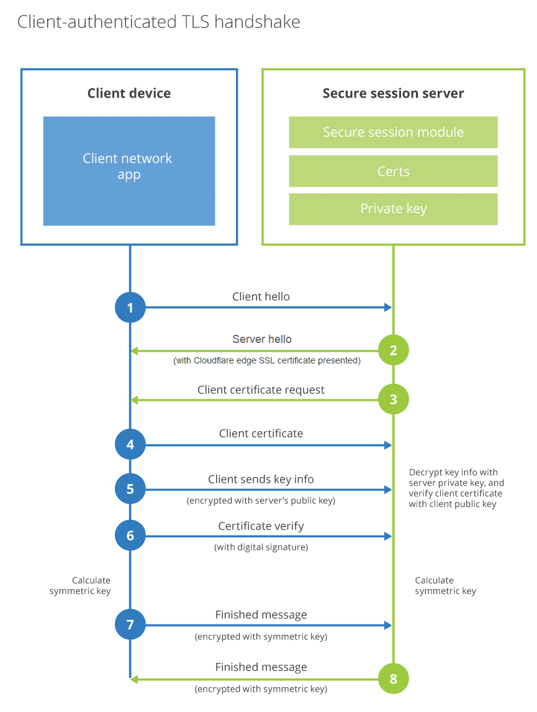

# [SSL] mTLS(Mutual TLS) Authentication
> date - 2021.05.21  
> keyworkd - ssl, tls, mtls, mutual authentication  
> mTLS에 대해 정리  

<br>

## mTLS(Mutual TLS) Authentication란?
* Mutual(상호간, 양방향)로 **server, client certificate를 서로 검증하는 방식**
* [TLS Handshake](./ssl.md#tls-handshake)에서 client certificate를 검증하는 과정이 추가된 것
  * TLS protocol은 X.509 certificate를 사용하여 client에 대한 server의 ID만 증명하고 server에 대한 client 인증은 application layer에 맡긴다
* **신뢰할 수 있는 x.509 certificate**를 제출하는 client만 server access 허용
  * x.509 certificate와 public/private key, CA certificate(신뢰할 수 있는 CA가 발행) 필요
  * certificate에는 client/server를 식별하기 위한 기본 정보와 digital signature 포함
* client의 certificate provisioning이 필요하여 사용자 친화적이지 않은 UX로 B2C(end user) application에서는 거의 사용되지 않는다
* IdP(Identity Provider)로 인증하지 않는 IoT devices나 B2B application에서 사용


<br>

## mTLS 과정

<br>

### Summary
<div align="center">
  
</div>

<br>

1. client가 server에 접속
2. server가 client로 server SSL certificate 전송
3. client가 server SSL certificate 확인
4. client가 server로 client SSL certificate 전송
5. server가 client SSL certificate 확인
6. server가 client SSL certificate의 사용자 이름을 참조해 사용자를 인증

<br>

<div align="center">
  
</div>

<br>

### 1. client가 server에 연결
* server에 `Client Hello` message를 아래의 정보와 같이 전송
  * SSL/TLS version
  * CipherSuite(client가 선호하는 순으로)
  * Data compression method
* server는 아래의 정보를 포함한 `Server Hello` message를 응답(client가 제공한 목록에서 server가 선택)
  * SSL/TLS version
    * CipherSuite
  * Data compression method
  * Session ID
  * Client certifiacte request(mTLS일 때만 전송한다)

<br>

### 2. client가 server의 유효성 검증
* server는 certificate(public key 포함)를 client에 전송
* server는 `Server Hello Done` message를 client에 전송
* client는 server certificate에서 아래 정보 확인
  * Certificate chain
  * Expiration date
  * Certificate revocation status
* client는 server의 public key로 random string을 암호화하여 server로 전송
* server는 private key로 복호화
  * random string은 client, server에서 symmetric key 생성시 사용

<br>

### 3. server에서 client 유효성 검사
* client는 certificate(public key 포함)를 server에 전송
* client는 client의 private key로 sign된 이전 message의 사본을 포함하는 `Certificate verify` message를 전송
* server는 client의 certificate에서 아래 정보 확인
  * Certificate chain
  * Expiration date
  * Certificate revocation status
* server는 client public key를 사용해 client `Certificate verify` message를 확인

<br>

### 4. handshake 완료 후 application data 전송
* client는 symmetric key로 암호회된 message를 전송
* server는 symmetric key로 암호화된 message를 전송
* handshake가 완료되면 client와 server를 data encrypt/decrypt에 symmetric key를 사용


<br>

## curl로 mTLS가 설정된 server에 접근하는 방법
* certificate는 발행되었다고 가정
```sh
$ curl --cacert ca.crt \
       --key client.key \
       --cert client.crt \
       https://example.com
```


<br>

## Conclusion
지금까지 Mutual TLS에 대해 알아보았다.  
public network에서 server to server communication에 TLS를 사용하면 보안성이 향상되므로 사용을 고려해보자  


<br><br>

> #### Reference
> * [Mutual authentication](https://en.wikipedia.org/wiki/Mutual_authentication)
> * [What is Mutual Authentication?](https://community.developer.visa.com/t5/Tutorials/What-is-Mutual-Authentication/ba-p/5757)
> * [Mutual TLS](https://developers.cloudflare.com/cloudflare-one/identity/devices/mutual-tls-authentication)
