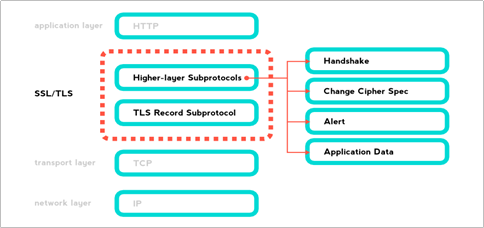
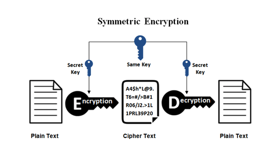
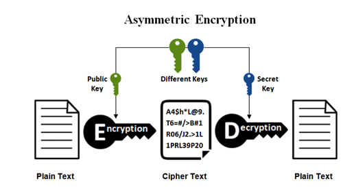
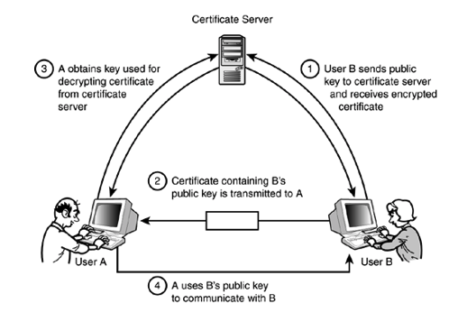
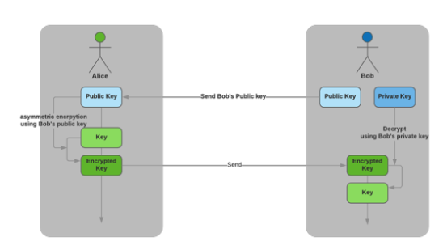
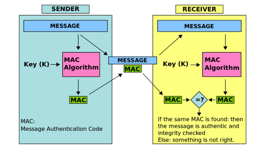
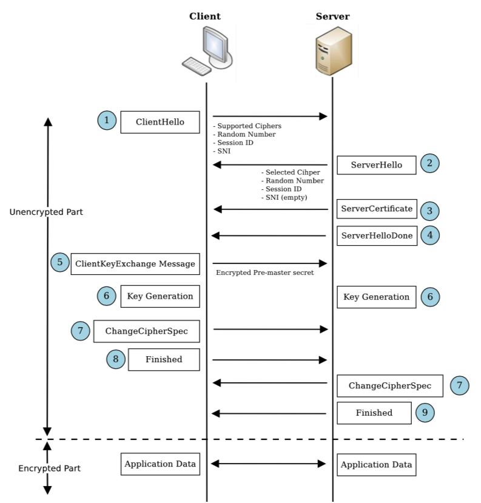

# [SSL] SSL(Secure Socket Layer) and TLS(Transport Layer Security)
> date - 2020.03.16  
> keyword - ssl, tls, security, https  
> HTTPS에서 사용되는 SSL/TLS에 대해 알아보자

<br>

## TLS(Transport Layer Security)란?
* 로그인 정보 및 결제시 입력한 신용 카드 번호 등의 데이터를 안정하게 전송하기 위한 security protocol
* Netscape에서 개발되어 IETF에 의해 **TLS(Transport Layer Security)로 표준화**
  * TLS는 SSL과 기술적으로 약간 다르지만 동일한 용어로 사용되는 경우가 많다
  * 기술적인 측면에서 **SSL -> TLS**
* TCP/IP ~ Application Layer 사이에 구현된 public key encryption를 사용한 protocol
* Authenticity(인증성), Confidentiality(기밀성), Integrity(무결성) 지원
* Man in The Middle Attack(MiTM), Packet Spoofing 등을 막을 수 있다

| Protocol | Publish | Status |
|:--|:--|:--|
| SSL 2.0 | 1995 | Deprecated in 2011 |
| SSL 3.0 | 1996 | Deprecated in 2015 |
| TLS 1.0 | 1999 | Deprecated in 2020 |
| TLS 1.1 | 2006 | Deprecated in 2020 |
| TLS 1.2 | 2008 | |
| TLS 1.3 | 2018 | |

<br>

### SSL/TLS Protocol structure


* 크게 `TLS Record protocol`과 `Higher-layer protocol`로 구성
* `Higher-layer protocol`은 `Handshake`, `Change Cipher Spec`, `Alert`, `Application Data` 4개의 subprotocol로 구분

<br>

#### Record Protocol
* `TCP protocol` 위에서 동작
* 상위 계층 메시지를 분할, 압축하고 MAC(message authentication code) 추가 및 암호화하는 작업 수행

#### Handshake Protocol
* client와 server는 상대방 확인 후 사용할 key exchange algorithm, encryption algorithm, key generation에 필요한 값 등을 전달하여 encryption channel 생성을 위한 항목들을 협상

#### Change Cipher Spec Protocol
* Handshake에서 data 암호화용 symmetric key 생성이 완료되고 난 후 data를 암호화하라는 신호를 보낸다

#### Alert Protocol
* 통신 과정에서 오류 발생 시 경고 메시지 전송

#### Application Data Protocol
* HTTP 같은 상위 계층 application의 data가 실제로 암호화되어 전송되는 부분


<br>

## TLS의 Cipher Suite
* 안전한 네트워크 연결을 위해 각각의 보안 목표를 달성하는 암호화 기법을 조합하여 Cipher Suite를 만들었다

### 일반적인 구조
```
TLS_[Key exchange/agreement]_[Authentication]_WITH_[Block/stream ciphers + size + mode]_[Message authentication + size]
```
* Authentication - Authenticity
* Block/stream ciphers - Confidentiality
* Message authentication - Integrity

<br>

### Algorithms supported in TLS 1.0 ~ 1.2 ciper suites
| Key exchange/agreement | Authentication | Block/stream ciphers | Message authentication |
|:--|:--|:--|:--|
| RSA | RSA | RC4 | Hash-based MD5 |
| Diffie-Hellman | DSA | Triple DES | SHA hash function |
| ECDH | ECDSA | AES | |
| SRP | | IDEA | |
| PSK | | DES | |
| | | Camellia | | 

<br>

### Example
```
TLS_ECDHE_RSA_WITH_AES_256_CBC_SHA256
```
* Key exchange/agreement - ECDHE
* Authentication - RSA
* Block/stream ciphers - AES_256_CBC
* Message authentication - SHA256


<br>

## Cryptographic Primitives
* `Cipher Suite`를 이루는 각각의 요소로 `Symmetric Encryption`, `Asymmetric Encryption`, `Key exchange/agreement`, `Message authentication code(MAC)` 등이 있다


<br>

### Symmetric Encryption


* encryption, decryption시 사용하는 key가 같은 암호화
* 속도가 빠르다
* key만 안전하게 보관한다면 안전
  * key shared를 어떻게 할지가 point
  * Confidentiality 제공
* `AES`, `SEED`, `ARIA`, `ChaCha20` 등


<br>

### Asymmetric Encryption


* encryption, decryption시 사용하는 key가 다른 암호화
* 서로 다른 key로 encryption/decryption 가능
  * 하나의 key로 encryption하면 다른 key로만 decryption 가능
* private, public key로 사용
* `RSA`, `DSA` 등


<br>

### Certificate


* TLS에서 **상대방이 통신하고자 하는 대상이 맞음**을 인증하기 위해 certificate를 사용
  * ID 카드와 같은 역할
* 모두가 신뢰할 수 있는 제 3자인 `CA(Certificate Authorities)`와 `Asymmetric Encryption` 필요
* A가 CA에 인증하여 인증서를 발급받고 B에게 전달 -> B는 CA에게 A로부터 받은 인증서가 유효한지 확인 후 맞으면 인증서에 포함된 public key로 데이터를 암호화하여 전달 -> A는 private key로 복호화하여 확인
* **CA를 신뢰**하기 때문에 인증서의 정확성까지 신뢰
* **X.509** - SSL certificate 표준

<br>

### Key exchange/agreement


* `Symmetric Encryption`을 사용하기 위해 안전하지 않은 network에서 **안전한 key exchange시 사용하는 Algorithms**
* `RSA key exchange`, `Diffie-Hellman key exchange` 등
* `RSA key exchange`는 **forward secrecy** or **perfect forward secrecy(PFS)** 을 보장하지 못한다
  * private key가 유출되면 안전을 보장할 수 없다
* `Diffie-Hellman key exchange`는 **forward secrecy**를 보장

<br>

### Message authentication code(MAC)


* `Symmetric Encryption` + `hash function`로 이해하면 쉽다
* **key에 따라서 나오는 hash가 다르다**
  * key를 모르면 같은 hash를 만들 수 없다
* `HMAC`, `CMAC`, `Poly1305`, `SipHash` 등


<br>

## TLS의 기본 절차
1. 지원 가능한 암호화 알고리즘과 메시지 인증 코드(MAC) 교환
2. key shared, 인증
3. Symmetric Key Encryption으로 암호화하고 메시지 인증


<br>

## TLS Handshake


#### 1. client와 server는 hello message로 기본적인 정보를 송수신(1)
* Supported Ciphers, Random number, Session ID, SNI 등
* Supported Ciphers - client와 server가 지원하는 cipher가 다를 수 있으므로 어떤 ciper를 사용할지 협상이 필요하고, 협상을 위해서 client가 사용할 수 있는 ciper를 전송
* Random number - **pre master secret**라는 symmetric key 생성시 사용
* Session ID - SSL handshaking overhead를 줄이기 위해 기존 session 에 사용할 ID
* SNI - Server Name Indication

#### 2. server도 client에게 hello message로 기본적인 정보를 송수신(2)
* Selected Cipher, Random number, Session ID, SNI 등
* Selected Cipher - client가 전달한 **Supported Ciphers 중 server가 선택**한 것

#### 3. server는 certificate 전달(3, 4)

#### 4. Key Exchange - client는 암호화 통신에 사용할 symmetric key(pre master secret) 생성 후 server의 public key로 encryption 후 server에 전달(5)
* client의 random number, server의 random number를 조합해 symmetric key 생성
* symmetric key의 안전을 위해 public key로 encryption하면 server는 private key로 decryption하여 안전하게 key를 교환할 수 있다

#### 5. key 생성(6)
* **pre master secret**를 가지고 **master secret**로 만든 후 session key 생성

#### 6. client는 암호화 통신 준비 완료를 server에 알리고 handshake 종료(7, 8)

#### 7. server도 암호화 통신 준비 완료를 client에 알리고 handshake 종료(7, 9)


<br>

## TLS Session
* Handshake를 통해 만들어진 암호화 session을 통해 server와 client가 **data를 주고 받는 단계**
* data를 session key를 이용해 symmetric key encryption 사용
  * 서로 session key를 알고 있기에 가능
* data 전송 완료 후 서로에게 알리고, session key(symmetric key)를 폐기


<br><br>

> #### Reference
> * [Transport Layer Security - Wikipedia](https://en.wikipedia.org/wiki/Transport_Layer_Security)
> * [보안 프로토콜, TLS 1.3](https://www.mobiinside.co.kr/2019/02/13/buzzvil-tls/)
> * [HTTPS와 SSL 인증서](https://opentutorials.org/course/228/4894)
